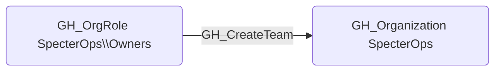

## Edge Schema

- Source: [GH_OrgRole](https://github.com/SpecterOps/bloodhound-docs/blob/main//opengraph/extensions/github/nodes/gh_orgrole)
- Destination: [GH_Organization](https://github.com/SpecterOps/bloodhound-docs/blob/main//opengraph/extensions/github/nodes/gh_organization)
- Traversable: ❌

## General Information

The non-traversable [GH_CreateTeam](https://github.com/SpecterOps/bloodhound-docs/blob/main//opengraph/extensions/github/edges/gh_createteam) edge represents that a role has the ability to create teams within the organization. Teams are the primary mechanism for granting groups of users access to repositories, so team creation is a stepping stone to broader access. This edge is created by the collector when enumerating organization role permissions, and its security significance lies in the fact that a newly created team can be granted repository access and then populated with controlled accounts.

