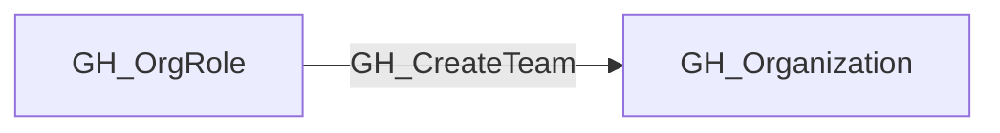
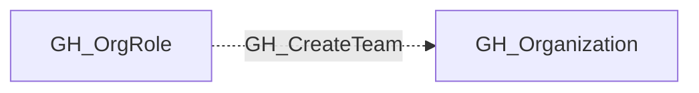

## Edge Schema

- Traversable: ❌

| Start | Kind | End |
|-------|-----------|-------|
| [GH_OrgRole](https://github.com/SpecterOps/bloodhound-docs/blob/main//opengraph/extensions/github/nodes/gh_orgrole) | GH_CreateTeam | [GH_Organization](https://github.com/SpecterOps/bloodhound-docs/blob/main//opengraph/extensions/github/nodes/gh_organization) |

```mermaid
flowchart LR
    GH_Organization["GH_Organization"]
    GH_OrgRole["GH_OrgRole"]
    GH_OrgRole -- GH_CreateTeam --> GH_Organization
```

## General Information

The non-traversable GH_CreateTeam edge represents that a role has the ability to create teams within the organization. Teams are the primary mechanism for granting groups of users access to repositories, so team creation is a stepping stone to broader access. This edge is created by the collector when enumerating organization role permissions, and its security significance lies in the fact that a newly created team can be granted repository access and then populated with controlled accounts.

## Edge Schema

| Source | Destination | Traversable |
| --- | --- | --- |
| [GH_OrgRole](https://github.com/SpecterOps/bloodhound-docs/blob/main//opengraph/extensions/github/nodes/gh_orgrole) | [GH_Organization](https://github.com/SpecterOps/bloodhound-docs/blob/main//opengraph/extensions/github/nodes/gh_organization) | `false` |

## Diagram

```mermaid
graph LR
    n0["GH_OrgRole"]
    n1["GH_Organization"]
    n0 -.->|GH_CreateTeam| n1
```
