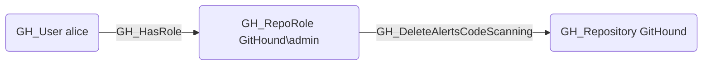

## Edge Schema

- Source: [GH_RepoRole](https://github.com/SpecterOps/bloodhound-docs/blob/main//opengraph/extensions/github/nodes/gh_reporole)
- Destination: [GH_Repository](https://github.com/SpecterOps/bloodhound-docs/blob/main//opengraph/extensions/github/nodes/gh_repository)
- Traversable: ❌

## General Information

The non-traversable [GH_DeleteAlertsCodeScanning](https://github.com/SpecterOps/bloodhound-docs/blob/main//opengraph/extensions/github/edges/gh_deletealertscodescanning) edge represents a role's ability to delete code scanning alerts from the repository. This permission is available to Admin roles and custom roles that have been granted this specific permission. Deleting code scanning alerts can obscure security vulnerabilities that have been detected in the codebase, which is significant from an audit and compliance perspective. An attacker with this permission could suppress evidence of vulnerabilities they have introduced.

