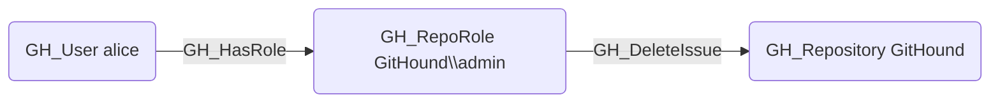

## Edge Schema

- Source: [GH_RepoRole](https://github.com/SpecterOps/bloodhound-docs/blob/main//opengraph/extensions/github/nodes/gh_reporole)
- Destination: [GH_Repository](https://github.com/SpecterOps/bloodhound-docs/blob/main//opengraph/extensions/github/nodes/gh_repository)
- Traversable: ❌

## General Information

The non-traversable [GH_DeleteIssue](https://github.com/SpecterOps/bloodhound-docs/blob/main//opengraph/extensions/github/edges/gh_deleteissue) edge represents a role's ability to delete issues permanently. Deleted issues cannot be recovered. This permission is available to Admin roles and custom roles that have been granted this specific permission. Deleting issues can destroy audit trails and remove evidence of security discussions or vulnerability reports.

