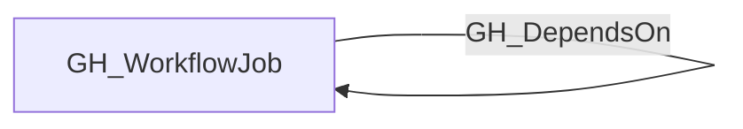
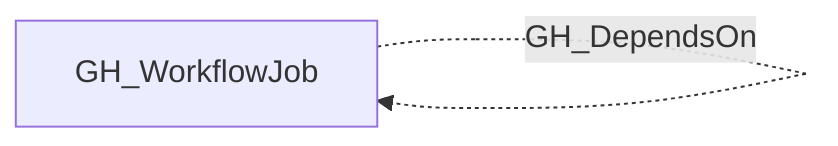

## Edge Schema

- Traversable: ❌

| Start | Kind | End |
|-------|-----------|-------|
| [GH_WorkflowJob](https://github.com/SpecterOps/bloodhound-docs/blob/main//opengraph/extensions/github/nodes/gh_workflowjob) | GH_DependsOn | [GH_WorkflowJob](https://github.com/SpecterOps/bloodhound-docs/blob/main//opengraph/extensions/github/nodes/gh_workflowjob) |

## General Information

The non-traversable GH_DependsOn edge represents a `needs:` dependency between two jobs in the same workflow. This edge captures execution order constraints — the source job will not start until the destination job completes successfully. This edge is non-traversable because it represents sequencing only, not an access or privilege path.

## Edge Schema

| Source | Destination | Traversable |
| --- | --- | --- |
| [GH_WorkflowJob](https://github.com/SpecterOps/bloodhound-docs/blob/main//opengraph/extensions/github/nodes/gh_workflowjob) | [GH_WorkflowJob](https://github.com/SpecterOps/bloodhound-docs/blob/main//opengraph/extensions/github/nodes/gh_workflowjob) | `false` |

## Diagram

