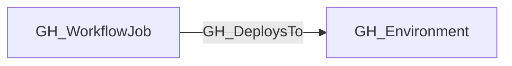
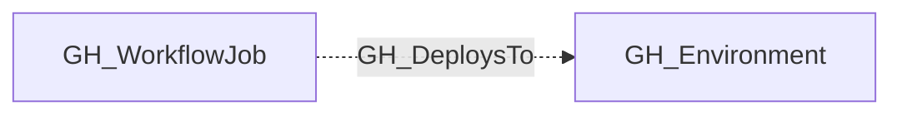

## Edge Schema

- Traversable: ❌

| Start | Kind | End |
|-------|-----------|-------|
| [GH_WorkflowJob](https://github.com/SpecterOps/bloodhound-docs/blob/main//opengraph/extensions/github/nodes/gh_workflowjob) | GH_DeploysTo | [GH_Environment](https://github.com/SpecterOps/bloodhound-docs/blob/main//opengraph/extensions/github/nodes/gh_environment) |

## General Information

The non-traversable GH_DeploysTo edge links a workflow job to the GitHub Environment it targets via the `environment:` key. This edge records which jobs deploy to which environments. Environments can gate deployments with protection rules (required reviewers, wait timers, deployment branch policies) and can expose environment-scoped secrets and variables.

## Edge Schema

| Source | Destination | Traversable |
| --- | --- | --- |
| [GH_WorkflowJob](https://github.com/SpecterOps/bloodhound-docs/blob/main//opengraph/extensions/github/nodes/gh_workflowjob) | [GH_Environment](https://github.com/SpecterOps/bloodhound-docs/blob/main//opengraph/extensions/github/nodes/gh_environment) | `false` |

## Diagram

