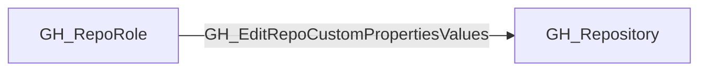
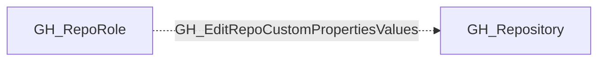

## Edge Schema

- Traversable: ❌

| Start | Kind | End |
|-------|-----------|-------|
| [GH_RepoRole](https://github.com/SpecterOps/bloodhound-docs/blob/main//opengraph/extensions/github/nodes/gh_reporole) | GH_EditRepoCustomPropertiesValues | [GH_Repository](https://github.com/SpecterOps/bloodhound-docs/blob/main//opengraph/extensions/github/nodes/gh_repository) |

## General Information

The non-traversable GH_EditRepoCustomPropertiesValues edge represents a role's ability to edit custom property values on the repository. This permission is available to Admin roles and custom roles that have been granted this specific permission. Custom properties are organization-defined metadata fields on repositories that can be used for classification, compliance tagging, or policy enforcement via rulesets. Modifying custom property values could alter which organization-level rulesets apply to the repository, potentially bypassing security controls that are scoped by property-based targeting.

## Edge Schema

| Source | Destination | Traversable |
| --- | --- | --- |
| [GH_RepoRole](https://github.com/SpecterOps/bloodhound-docs/blob/main//opengraph/extensions/github/nodes/gh_reporole) | [GH_Repository](https://github.com/SpecterOps/bloodhound-docs/blob/main//opengraph/extensions/github/nodes/gh_repository) | `false` |

## Diagram

