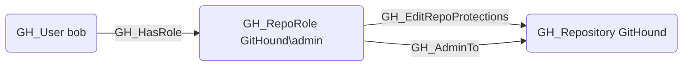

## Edge Schema

- Source: [GH_RepoRole](https://github.com/SpecterOps/bloodhound-docs/blob/main//opengraph/extensions/github/nodes/gh_reporole)
- Destination: [GH_Repository](https://github.com/SpecterOps/bloodhound-docs/blob/main//opengraph/extensions/github/nodes/gh_repository)
- Traversable: ❌

## General Information

The non-traversable GH_EditRepoProtections edge represents a role's ability to edit or remove branch protection rules on the repository. This permission is available to Admin roles and custom roles that have been granted this specific permission. Modifying a branch protection rule is an indirect bypass -- removing or weakening protections opens the branch to direct push or unreviewed merges, making this a high-severity permission from a security perspective. Attack paths that include this edge can escalate to full branch write access by first disabling protections.

