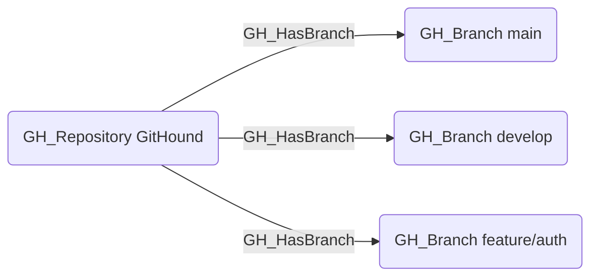

## Edge Schema

- Source: [GH_Repository](https://github.com/SpecterOps/bloodhound-docs/blob/main//opengraph/extensions/github/nodes/gh_repository)
- Destination: [GH_Branch](https://github.com/SpecterOps/bloodhound-docs/blob/main//opengraph/extensions/github/nodes/gh_branch)
- Traversable: ❌

## General Information

The non-traversable GH_HasBranch edge represents the relationship between a repository and its branches. This edge links each collected branch to its parent repository. It is a structural edge that provides the foundation for understanding branch-level protections and access controls. While not traversable itself, it connects repositories to branches where traversable edges like [GH_CanWriteBranch](https://github.com/SpecterOps/bloodhound-docs/blob/main//opengraph/extensions/github/edges/gh_canwritebranch) and [GH_CanEditProtection](https://github.com/SpecterOps/bloodhound-docs/blob/main//opengraph/extensions/github/edges/gh_caneditprotection) model the effective access.

