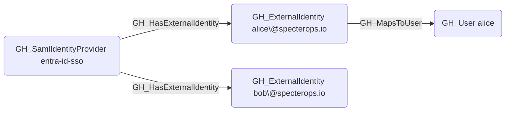

## Edge Schema

- Source: [GH_SamlIdentityProvider](https://github.com/SpecterOps/bloodhound-docs/blob/main//opengraph/extensions/github/nodes/gh_samlidentityprovider)
- Destination: [GH_ExternalIdentity](https://github.com/SpecterOps/bloodhound-docs/blob/main//opengraph/extensions/github/nodes/gh_externalidentity)
- Traversable: ❌

## General Information

The non-traversable GH_HasExternalIdentity edge represents the relationship between a SAML identity provider and the external identities (SSO users) it manages. This edge links each external identity to the SAML provider that authenticated it. External identities are a key component in cross-platform attack path analysis because they bridge the gap between corporate identity providers and GitHub user accounts via the [GH_MapsToUser](https://github.com/SpecterOps/bloodhound-docs/blob/main//opengraph/extensions/github/edges/gh_mapstouser) edge. Enumerating external identities reveals which corporate users have linked GitHub accounts and enables mapping from IdP compromise to GitHub access.

