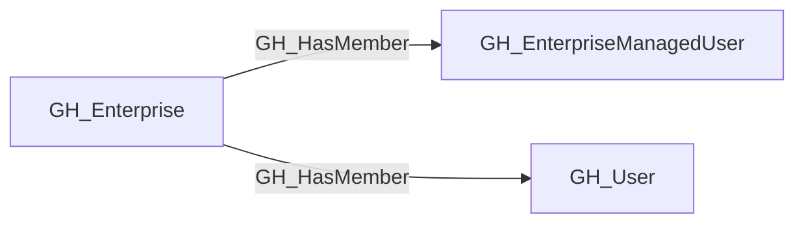
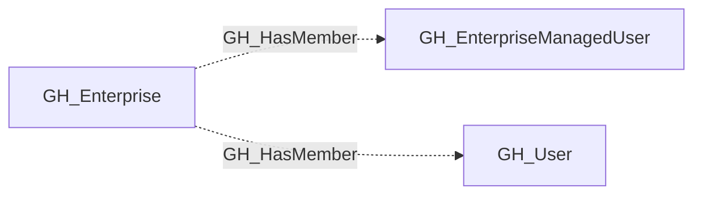

## Edge Schema

- Traversable: ❌

| Start | Kind | End |
|-------|-----------|-------|
| [GH_Enterprise](https://github.com/SpecterOps/bloodhound-docs/blob/main//opengraph/extensions/github/nodes/gh_enterprise) | GH_HasMember | [GH_User](https://github.com/SpecterOps/bloodhound-docs/blob/main//opengraph/extensions/github/nodes/gh_user) |
| [GH_Enterprise](https://github.com/SpecterOps/bloodhound-docs/blob/main//opengraph/extensions/github/nodes/gh_enterprise) | GH_HasMember | [GH_EnterpriseManagedUser](https://github.com/SpecterOps/bloodhound-docs/blob/main//opengraph/extensions/github/nodes/gh_enterprisemanageduser) |

## General Information

The non-traversable GH_HasMember edge represents the relationship between a GitHub enterprise or organization and a user who is a member of that scope. This edge records membership as directory context rather than as an access path: being listed as a member does not by itself describe what the user can do, only that the user belongs to the enterprise or organization. Membership remains security-relevant because it defines the population from which roles, team assignments, and token approvals are drawn, and it helps analysts understand who is inside the trust boundary when reviewing GitHub exposure.

## Edge Schema

| Source | Destination | Traversable |
| --- | --- | --- |
| [GH_Enterprise](https://github.com/SpecterOps/bloodhound-docs/blob/main//opengraph/extensions/github/nodes/gh_enterprise) | [GH_EnterpriseManagedUser](https://github.com/SpecterOps/bloodhound-docs/blob/main//opengraph/extensions/github/nodes/gh_enterprisemanageduser) | `false` |
| [GH_Enterprise](https://github.com/SpecterOps/bloodhound-docs/blob/main//opengraph/extensions/github/nodes/gh_enterprise) | [GH_User](https://github.com/SpecterOps/bloodhound-docs/blob/main//opengraph/extensions/github/nodes/gh_user) | `false` |

## Diagram

