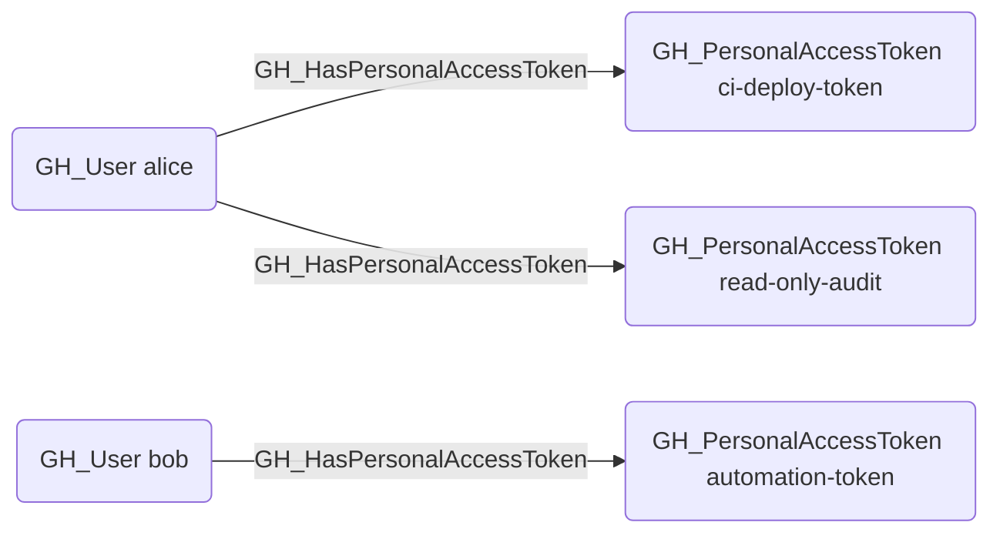

## Edge Schema

- Source: [GH_User](https://github.com/SpecterOps/bloodhound-docs/blob/main//opengraph/extensions/github/nodes/gh_user)
- Destination: [GH_PersonalAccessToken](https://github.com/SpecterOps/bloodhound-docs/blob/main//opengraph/extensions/github/nodes/gh_personalaccesstoken)
- Traversable: ❌

## General Information

The non-traversable [GH_HasPersonalAccessToken](https://github.com/SpecterOps/bloodhound-docs/blob/main//opengraph/extensions/github/edges/gh_haspersonalaccesstoken) edge represents the relationship between a user and their fine-grained personal access tokens that have been granted access to the organization. Created by `Git-HoundPersonalAccessToken`, this edge links each approved token back to the user who created it. Fine-grained personal access tokens are security-significant because they provide programmatic access to organization resources with specific scoped permissions. Tracking token ownership is essential for understanding which users have standing API access and for identifying tokens that may need revocation.

