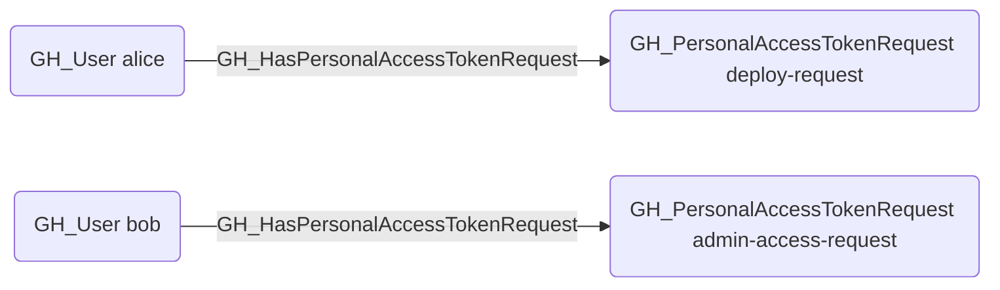

## Edge Schema

- Source: [GH_User](https://github.com/SpecterOps/bloodhound-docs/blob/main//opengraph/extensions/github/nodes/gh_user)
- Destination: [GH_PersonalAccessTokenRequest](https://github.com/SpecterOps/bloodhound-docs/blob/main//opengraph/extensions/github/nodes/gh_personalaccesstokenrequest)
- Traversable: ❌

## General Information

The non-traversable GH_HasPersonalAccessTokenRequest edge represents the relationship between a user and their pending personal access token requests awaiting organizational approval. This edge links each pending token request back to the user who submitted it. Pending token requests are security-relevant because they represent access that may soon be granted, and reviewing them helps administrators understand what permissions users are requesting before approval. Organizations that require approval for fine-grained PATs will have these requests queued until an administrator acts on them.

