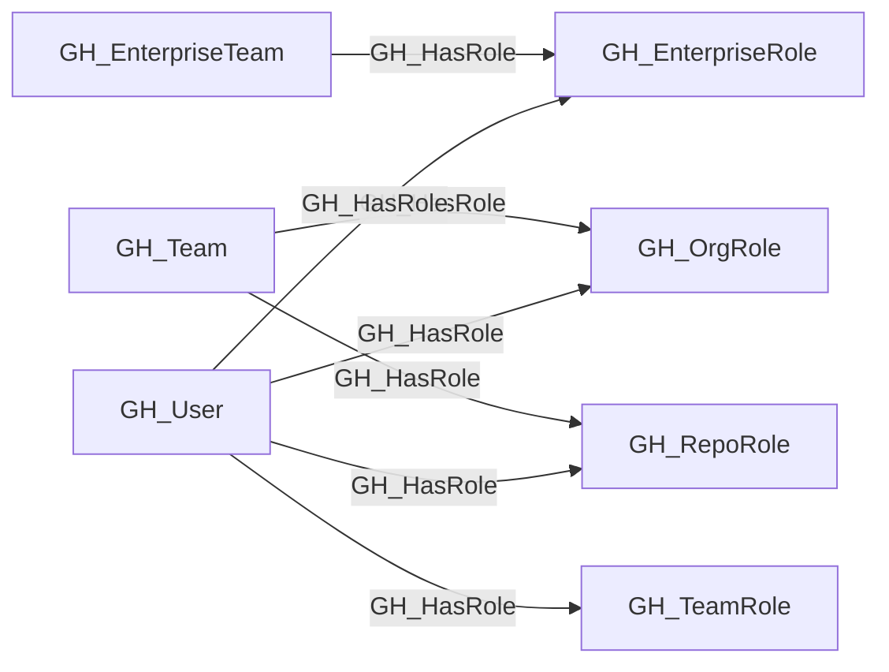

## Edge Schema

- Traversable: ✅

| Start | Kind | End |
|-------|-----------|-------|
| [GH_User](https://github.com/SpecterOps/bloodhound-docs/blob/main//opengraph/extensions/github/nodes/gh_user) | GH_HasRole | [GH_TeamRole](https://github.com/SpecterOps/bloodhound-docs/blob/main//opengraph/extensions/github/nodes/gh_teamrole) |
| [GH_User](https://github.com/SpecterOps/bloodhound-docs/blob/main//opengraph/extensions/github/nodes/gh_user) | GH_HasRole | [GH_OrgRole](https://github.com/SpecterOps/bloodhound-docs/blob/main//opengraph/extensions/github/nodes/gh_orgrole) |
| [GH_User](https://github.com/SpecterOps/bloodhound-docs/blob/main//opengraph/extensions/github/nodes/gh_user) | GH_HasRole | [GH_EnterpriseRole](https://github.com/SpecterOps/bloodhound-docs/blob/main//opengraph/extensions/github/nodes/gh_enterpriserole) |
| [GH_EnterpriseTeam](https://github.com/SpecterOps/bloodhound-docs/blob/main//opengraph/extensions/github/nodes/gh_enterpriseteam) | GH_HasRole | [GH_EnterpriseRole](https://github.com/SpecterOps/bloodhound-docs/blob/main//opengraph/extensions/github/nodes/gh_enterpriserole) |
| [GH_Team](https://github.com/SpecterOps/bloodhound-docs/blob/main//opengraph/extensions/github/nodes/gh_team) | GH_HasRole | [GH_OrgRole](https://github.com/SpecterOps/bloodhound-docs/blob/main//opengraph/extensions/github/nodes/gh_orgrole) |
| [GH_User](https://github.com/SpecterOps/bloodhound-docs/blob/main//opengraph/extensions/github/nodes/gh_user) | GH_HasRole | [GH_RepoRole](https://github.com/SpecterOps/bloodhound-docs/blob/main//opengraph/extensions/github/nodes/gh_reporole) |
| [GH_Team](https://github.com/SpecterOps/bloodhound-docs/blob/main//opengraph/extensions/github/nodes/gh_team) | GH_HasRole | [GH_RepoRole](https://github.com/SpecterOps/bloodhound-docs/blob/main//opengraph/extensions/github/nodes/gh_reporole) |

```mermaid
flowchart LR
    GH_EnterpriseRole["GH_EnterpriseRole"]
    GH_EnterpriseTeam["GH_EnterpriseTeam"]
    GH_OrgRole["GH_OrgRole"]
    GH_RepoRole["GH_RepoRole"]
    GH_Team["GH_Team"]
    GH_TeamRole["GH_TeamRole"]
    GH_User["GH_User"]
    GH_EnterpriseTeam -- GH_HasRole --> GH_EnterpriseRole
    GH_Team -- GH_HasRole --> GH_OrgRole
    GH_Team -- GH_HasRole --> GH_RepoRole
    GH_User -- GH_HasRole --> GH_EnterpriseRole
    GH_User -- GH_HasRole --> GH_OrgRole
    GH_User -- GH_HasRole --> GH_RepoRole
    GH_User -- GH_HasRole --> GH_TeamRole
```

## General Information

The traversable GH_HasRole edge represents the assignment of a user or team to a specific role within the organization, repository, or team. This is the primary edge for connecting identities to their permissions and serves as the foundation of all access paths in the GitHub permission model. Because role assignment is the starting point for determining what a principal can do, this edge is traversable and critical for attack path analysis.

## Edge Schema

| Source | Destination | Traversable |
| --- | --- | --- |
| [GH_EnterpriseTeam](https://github.com/SpecterOps/bloodhound-docs/blob/main//opengraph/extensions/github/nodes/gh_enterpriseteam) | [GH_EnterpriseRole](https://github.com/SpecterOps/bloodhound-docs/blob/main//opengraph/extensions/github/nodes/gh_enterpriserole) | `true` |
| [GH_Team](https://github.com/SpecterOps/bloodhound-docs/blob/main//opengraph/extensions/github/nodes/gh_team) | [GH_OrgRole](https://github.com/SpecterOps/bloodhound-docs/blob/main//opengraph/extensions/github/nodes/gh_orgrole) | `true` |
| [GH_Team](https://github.com/SpecterOps/bloodhound-docs/blob/main//opengraph/extensions/github/nodes/gh_team) | [GH_RepoRole](https://github.com/SpecterOps/bloodhound-docs/blob/main//opengraph/extensions/github/nodes/gh_reporole) | `true` |
| [GH_User](https://github.com/SpecterOps/bloodhound-docs/blob/main//opengraph/extensions/github/nodes/gh_user) | [GH_EnterpriseRole](https://github.com/SpecterOps/bloodhound-docs/blob/main//opengraph/extensions/github/nodes/gh_enterpriserole) | `true` |
| [GH_User](https://github.com/SpecterOps/bloodhound-docs/blob/main//opengraph/extensions/github/nodes/gh_user) | [GH_OrgRole](https://github.com/SpecterOps/bloodhound-docs/blob/main//opengraph/extensions/github/nodes/gh_orgrole) | `true` |
| [GH_User](https://github.com/SpecterOps/bloodhound-docs/blob/main//opengraph/extensions/github/nodes/gh_user) | [GH_RepoRole](https://github.com/SpecterOps/bloodhound-docs/blob/main//opengraph/extensions/github/nodes/gh_reporole) | `true` |
| [GH_User](https://github.com/SpecterOps/bloodhound-docs/blob/main//opengraph/extensions/github/nodes/gh_user) | [GH_TeamRole](https://github.com/SpecterOps/bloodhound-docs/blob/main//opengraph/extensions/github/nodes/gh_teamrole) | `true` |

## Diagram

```mermaid
graph LR
    n0["GH_EnterpriseTeam"]
    n1["GH_EnterpriseRole"]
    n2["GH_Team"]
    n3["GH_OrgRole"]
    n4["GH_RepoRole"]
    n5["GH_User"]
    n6["GH_TeamRole"]
    n0 -->|GH_HasRole| n1
    n2 -->|GH_HasRole| n3
    n2 -->|GH_HasRole| n4
    n5 -->|GH_HasRole| n1
    n5 -->|GH_HasRole| n3
    n5 -->|GH_HasRole| n4
    n5 -->|GH_HasRole| n6
```
