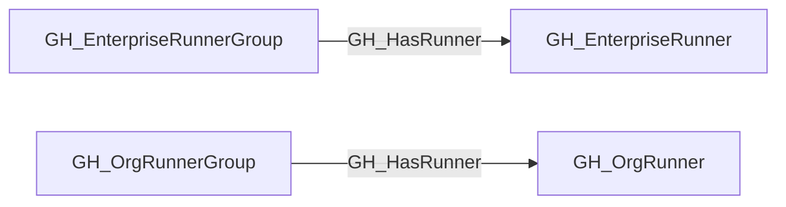

## Edge Schema

- Traversable: ✅

| Start | Kind | End |
|-------|-----------|-------|
| [GH_OrgRunnerGroup](https://github.com/SpecterOps/bloodhound-docs/blob/main//opengraph/extensions/github/nodes/gh_orgrunnergroup) | GH_HasRunner | [GH_OrgRunner](https://github.com/SpecterOps/bloodhound-docs/blob/main//opengraph/extensions/github/nodes/gh_orgrunner) |
| [GH_EnterpriseRunnerGroup](https://github.com/SpecterOps/bloodhound-docs/blob/main//opengraph/extensions/github/nodes/gh_enterpriserunnergroup) | GH_HasRunner | [GH_EnterpriseRunner](https://github.com/SpecterOps/bloodhound-docs/blob/main//opengraph/extensions/github/nodes/gh_enterpriserunner) |

## General Information

The traversable GH_HasRunner edge represents that a runner group exposes a directly assigned self-hosted runner to repositories or workflows that satisfy the runner group's access policy.

This edge is distinct from [GH_Contains](https://github.com/SpecterOps/bloodhound-docs/blob/main//opengraph/extensions/github/edges/gh_contains). [GH_Contains](https://github.com/SpecterOps/bloodhound-docs/blob/main//opengraph/extensions/github/edges/gh_contains) records structural membership only, while GH_HasRunner represents the runner-group-to-runner capability hop used for attack-path composition. This edge is emitted only for direct organization and enterprise runner group memberships; inherited organization runner group access to enterprise runners is modeled as [GH_Repository](https://github.com/SpecterOps/bloodhound-docs/blob/main//opengraph/extensions/github/nodes/gh_repository) or [GH_Branch](https://github.com/SpecterOps/bloodhound-docs/blob/main//opengraph/extensions/github/nodes/gh_branch) -[:[GH_CanUseRunner](https://github.com/SpecterOps/bloodhound-docs/blob/main//opengraph/extensions/github/edges/gh_canuserunner)]-> [GH_OrgRunnerGroup](https://github.com/SpecterOps/bloodhound-docs/blob/main//opengraph/extensions/github/nodes/gh_orgrunnergroup) -[:[GH_InheritedFrom](https://github.com/SpecterOps/bloodhound-docs/blob/main//opengraph/extensions/github/edges/gh_inheritedfrom)]-> [GH_EnterpriseRunnerGroup](https://github.com/SpecterOps/bloodhound-docs/blob/main//opengraph/extensions/github/nodes/gh_enterpriserunnergroup) -[:GH_HasRunner]-> [GH_EnterpriseRunner](https://github.com/SpecterOps/bloodhound-docs/blob/main//opengraph/extensions/github/nodes/gh_enterpriserunner).

## Edge Schema

| Source | Destination | Traversable |
| --- | --- | --- |
| [GH_EnterpriseRunnerGroup](https://github.com/SpecterOps/bloodhound-docs/blob/main//opengraph/extensions/github/nodes/gh_enterpriserunnergroup) | [GH_EnterpriseRunner](https://github.com/SpecterOps/bloodhound-docs/blob/main//opengraph/extensions/github/nodes/gh_enterpriserunner) | `true` |
| [GH_OrgRunnerGroup](https://github.com/SpecterOps/bloodhound-docs/blob/main//opengraph/extensions/github/nodes/gh_orgrunnergroup) | [GH_OrgRunner](https://github.com/SpecterOps/bloodhound-docs/blob/main//opengraph/extensions/github/nodes/gh_orgrunner) | `true` |

## Diagram

