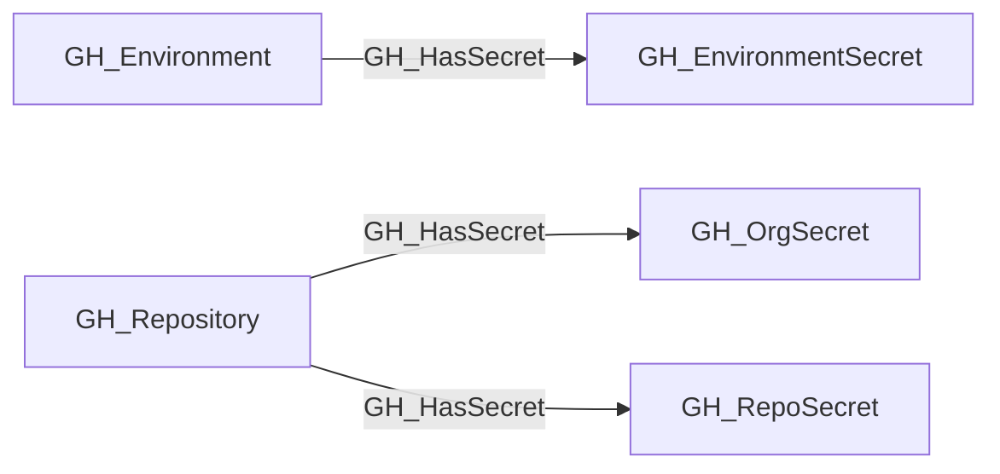

## Edge Schema

- Traversable: ✅

| Start | Kind | End |
|-------|-----------|-------|
| [GH_Repository](https://github.com/SpecterOps/bloodhound-docs/blob/main//opengraph/extensions/github/nodes/gh_repository) | GH_HasSecret | [GH_RepoSecret](https://github.com/SpecterOps/bloodhound-docs/blob/main//opengraph/extensions/github/nodes/gh_reposecret) |
| [GH_Repository](https://github.com/SpecterOps/bloodhound-docs/blob/main//opengraph/extensions/github/nodes/gh_repository) | GH_HasSecret | [GH_OrgSecret](https://github.com/SpecterOps/bloodhound-docs/blob/main//opengraph/extensions/github/nodes/gh_orgsecret) |
| [GH_Environment](https://github.com/SpecterOps/bloodhound-docs/blob/main//opengraph/extensions/github/nodes/gh_environment) | GH_HasSecret | [GH_EnvironmentSecret](https://github.com/SpecterOps/bloodhound-docs/blob/main//opengraph/extensions/github/nodes/gh_environmentsecret) |

## General Information

The traversable GH_HasSecret edge represents the relationship between a repository or environment and the secrets accessible within that context. This edge shows which secrets are available in which scopes. Repositories can have access to both organization-level secrets (scoped to selected repositories) and repository-level secrets, while environments expose their own environment-scoped secrets to jobs that target them. This edge is traversable because any principal that can execute a workflow in the relevant context may be able to exfiltrate secret values at runtime, making this a meaningful link in attack path analysis.

## Edge Schema

| Source | Destination | Traversable |
| --- | --- | --- |
| [GH_Environment](https://github.com/SpecterOps/bloodhound-docs/blob/main//opengraph/extensions/github/nodes/gh_environment) | [GH_EnvironmentSecret](https://github.com/SpecterOps/bloodhound-docs/blob/main//opengraph/extensions/github/nodes/gh_environmentsecret) | `true` |
| [GH_Repository](https://github.com/SpecterOps/bloodhound-docs/blob/main//opengraph/extensions/github/nodes/gh_repository) | [GH_OrgSecret](https://github.com/SpecterOps/bloodhound-docs/blob/main//opengraph/extensions/github/nodes/gh_orgsecret) | `true` |
| [GH_Repository](https://github.com/SpecterOps/bloodhound-docs/blob/main//opengraph/extensions/github/nodes/gh_repository) | [GH_RepoSecret](https://github.com/SpecterOps/bloodhound-docs/blob/main//opengraph/extensions/github/nodes/gh_reposecret) | `true` |

## Diagram

