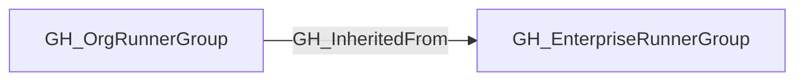

## Edge Schema

- Traversable: ✅

| Start | Kind | End |
|-------|-----------|-------|
| [GH_OrgRunnerGroup](https://github.com/SpecterOps/bloodhound-docs/blob/main//opengraph/extensions/github/nodes/gh_orgrunnergroup) | GH_InheritedFrom | [GH_EnterpriseRunnerGroup](https://github.com/SpecterOps/bloodhound-docs/blob/main//opengraph/extensions/github/nodes/gh_enterpriserunnergroup) |

## General Information

The traversable GH_InheritedFrom edge links an inherited [GH_OrgRunnerGroup](https://github.com/SpecterOps/bloodhound-docs/blob/main//opengraph/extensions/github/nodes/gh_orgrunnergroup) to the [GH_EnterpriseRunnerGroup](https://github.com/SpecterOps/bloodhound-docs/blob/main//opengraph/extensions/github/nodes/gh_enterpriserunnergroup) that owns the underlying runner set. This preserves the organization-local view of a runner group while still identifying the enterprise source that provides the runners.

This edge is traversable because an inherited organization runner group is the organization-facing policy boundary for the enterprise runner group. Repository access flows through the organization runner group, then through GH_InheritedFrom to the enterprise group, and finally through [GH_HasRunner](https://github.com/SpecterOps/bloodhound-docs/blob/main//opengraph/extensions/github/edges/gh_hasrunner) to directly assigned enterprise runners.

## Edge Schema

| Source | Destination | Traversable |
| --- | --- | --- |
| [GH_OrgRunnerGroup](https://github.com/SpecterOps/bloodhound-docs/blob/main//opengraph/extensions/github/nodes/gh_orgrunnergroup) | [GH_EnterpriseRunnerGroup](https://github.com/SpecterOps/bloodhound-docs/blob/main//opengraph/extensions/github/nodes/gh_enterpriserunnergroup) | `true` |

## Diagram

