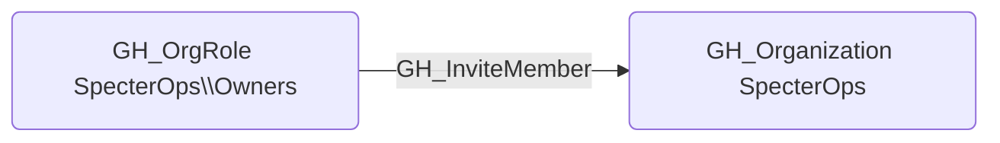

## Edge Schema

- Source: [GH_OrgRole](https://github.com/SpecterOps/bloodhound-docs/blob/main//opengraph/extensions/github/nodes/gh_orgrole)
- Destination: [GH_Organization](https://github.com/SpecterOps/bloodhound-docs/blob/main//opengraph/extensions/github/nodes/gh_organization)
- Traversable: ❌

## General Information

The non-traversable GH_InviteMember edge represents that a role has the ability to invite new members to the organization. This permission is typically restricted to Owners, as inviting members expands the organization's trust boundary by granting new users access to internal resources. An attacker with this permission could invite a controlled account to gain persistent access to the organization's repositories, teams, and secrets.

