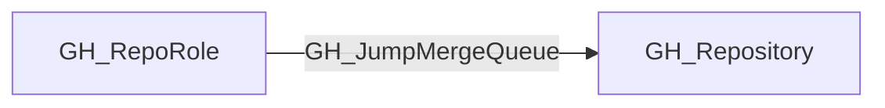
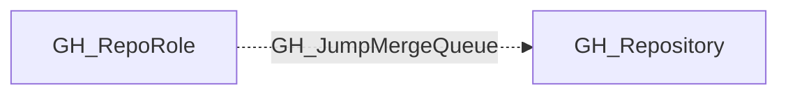

## Edge Schema

- Traversable: ❌

| Start | Kind | End |
|-------|-----------|-------|
| [GH_RepoRole](https://github.com/SpecterOps/bloodhound-docs/blob/main//opengraph/extensions/github/nodes/gh_reporole) | GH_JumpMergeQueue | [GH_Repository](https://github.com/SpecterOps/bloodhound-docs/blob/main//opengraph/extensions/github/nodes/gh_repository) |

```mermaid
flowchart LR
    GH_RepoRole["GH_RepoRole"]
    GH_Repository["GH_Repository"]
    GH_RepoRole -- GH_JumpMergeQueue --> GH_Repository
```

## General Information

The non-traversable GH_JumpMergeQueue edge represents a role's ability to jump ahead of other entries in the merge queue. This permission is available to Admin roles and custom roles that have been granted this specific permission. Merge queues enforce an ordered sequence of CI checks and merges; jumping the queue allows a principal to prioritize their changes ahead of others. While less severe than bypassing protections entirely, this permission can be used to accelerate the landing of malicious changes before other queued entries are reviewed or tested.

## Edge Schema

| Source | Destination | Traversable |
| --- | --- | --- |
| [GH_RepoRole](https://github.com/SpecterOps/bloodhound-docs/blob/main//opengraph/extensions/github/nodes/gh_reporole) | [GH_Repository](https://github.com/SpecterOps/bloodhound-docs/blob/main//opengraph/extensions/github/nodes/gh_repository) | `false` |

## Diagram

```mermaid
graph LR
    n0["GH_RepoRole"]
    n1["GH_Repository"]
    n0 -.->|GH_JumpMergeQueue| n1
```
