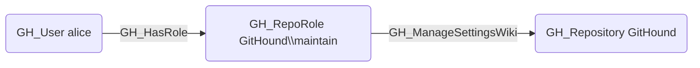

## Edge Schema

- Source: [GH_RepoRole](https://github.com/SpecterOps/bloodhound-docs/blob/main//opengraph/extensions/github/nodes/gh_reporole)
- Destination: [GH_Repository](https://github.com/SpecterOps/bloodhound-docs/blob/main//opengraph/extensions/github/nodes/gh_repository)
- Traversable: ❌

## General Information

The non-traversable GH_ManageSettingsWiki edge represents a role's ability to enable or disable the repository wiki. This permission is available to Maintain and Admin roles and custom roles that have been granted this specific permission.

