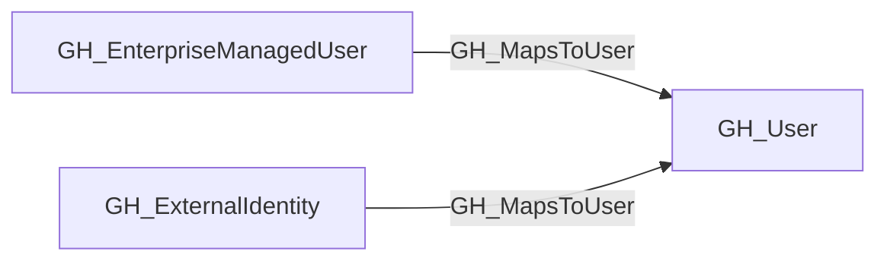
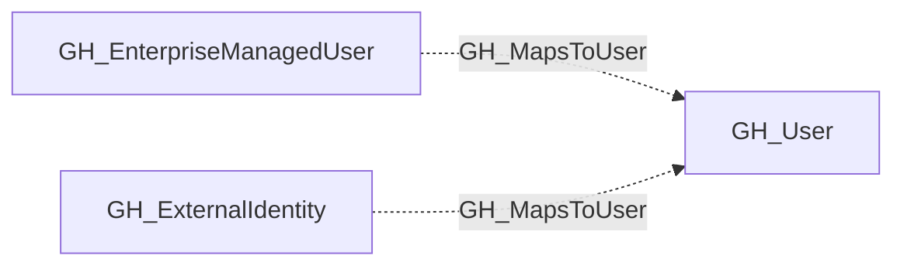

## Edge Schema

- Traversable: ❌

| Start | Kind | End |
|-------|-----------|-------|
| [GH_ExternalIdentity](https://github.com/SpecterOps/bloodhound-docs/blob/main//opengraph/extensions/github/nodes/gh_externalidentity) | GH_MapsToUser | [GH_User](https://github.com/SpecterOps/bloodhound-docs/blob/main//opengraph/extensions/github/nodes/gh_user) |
| [GH_EnterpriseManagedUser](https://github.com/SpecterOps/bloodhound-docs/blob/main//opengraph/extensions/github/nodes/gh_enterprisemanageduser) | GH_MapsToUser | [GH_User](https://github.com/SpecterOps/bloodhound-docs/blob/main//opengraph/extensions/github/nodes/gh_user) |

## General Information

The non-traversable GH_MapsToUser edge maps an external identity (provisioned via SAML or SCIM) to a GitHub user within the organization, or to an external IdP user (such as [AZUser](https://github.com/SpecterOps/bloodhound-docs/blob/main//resources/nodes/az-user), [Okta_User](https://github.com/SpecterOps/bloodhound-docs/blob/main//opengraph/extensions/okta/nodes/okta_user), or [PingOneUser](https://github.com/andyrobbins/PingOneHound?tab=readme-ov-file#schema)) in hybrid graph scenarios. This edge represents identity correlation rather than an attack path, connecting a user's external IdP account to their GitHub account for visibility into federated identity mappings.

## Edge Schema

| Source | Destination | Traversable |
| --- | --- | --- |
| [GH_EnterpriseManagedUser](https://github.com/SpecterOps/bloodhound-docs/blob/main//opengraph/extensions/github/nodes/gh_enterprisemanageduser) | [GH_User](https://github.com/SpecterOps/bloodhound-docs/blob/main//opengraph/extensions/github/nodes/gh_user) | `false` |
| [GH_ExternalIdentity](https://github.com/SpecterOps/bloodhound-docs/blob/main//opengraph/extensions/github/nodes/gh_externalidentity) | [GH_User](https://github.com/SpecterOps/bloodhound-docs/blob/main//opengraph/extensions/github/nodes/gh_user) | `false` |

## Diagram

