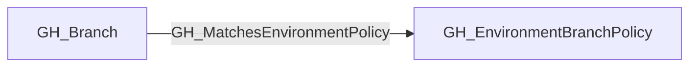

## Edge Schema

- Traversable: ❌

| Start | Kind | End |
|-------|-----------|-------|
| [GH_Branch](https://github.com/SpecterOps/bloodhound-docs/blob/main//opengraph/extensions/github/nodes/gh_branch) | GH_MatchesEnvironmentPolicy | [GH_EnvironmentBranchPolicy](https://github.com/SpecterOps/bloodhound-docs/blob/main//opengraph/extensions/github/nodes/gh_environmentbranchpolicy) |

## General Information

The non-traversable GH_MatchesEnvironmentPolicy edge links a branch to a GitHub Environment deployment branch policy that it satisfies.

This edge is emitted when a branch name matches the pattern defined by a [GH_EnvironmentBranchPolicy](https://github.com/SpecterOps/bloodhound-docs/blob/main//opengraph/extensions/github/nodes/gh_environmentbranchpolicy) node, such as `main`, `release/*`, or `release/**/*`. The edge is structural rather than directly traversable because matching a policy alone does not guarantee deployment access; the environment may still require protected branches, reviewers, wait timers, or other controls.

GH_MatchesEnvironmentPolicy is primarily used as supporting evidence for computed [GH_CanDeployToEnvironment](https://github.com/SpecterOps/bloodhound-docs/blob/main//opengraph/extensions/github/edges/gh_candeploytoenvironment) edges.

## Edge Schema

| Source | Destination | Traversable |
| --- | --- | --- |
| [GH_Branch](https://github.com/SpecterOps/bloodhound-docs/blob/main//opengraph/extensions/github/nodes/gh_branch) | [GH_EnvironmentBranchPolicy](https://github.com/SpecterOps/bloodhound-docs/blob/main//opengraph/extensions/github/nodes/gh_environmentbranchpolicy) | `false` |

## Diagram

