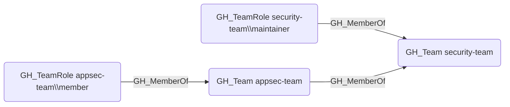

## Edge Schema

- Source: [GH_TeamRole](https://github.com/SpecterOps/bloodhound-docs/blob/main//opengraph/extensions/github/nodes/gh_teamrole), [GH_Team](https://github.com/SpecterOps/bloodhound-docs/blob/main//opengraph/extensions/github/nodes/gh_team)
- Destination: [GH_Team](https://github.com/SpecterOps/bloodhound-docs/blob/main//opengraph/extensions/github/nodes/gh_team)
- Traversable: ✅

## General Information

The traversable GH_MemberOf edge represents team membership, linking a team role to its parent team or a child team to a parent team in nested team hierarchies. This edge is traversable because team membership extends access transitively -- a user who holds a role in a child team inherits the repository permissions of all ancestor teams in the nesting hierarchy, making it a key component of attack path analysis.

