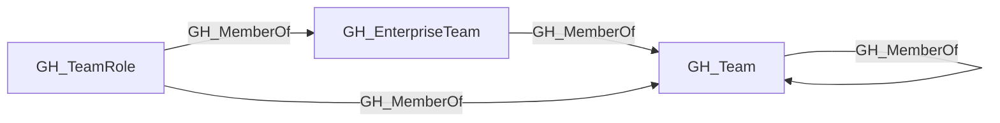
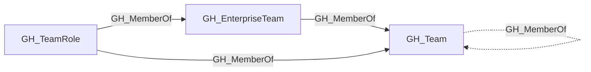

## Edge Schema

- Traversable: ✅

| Start | Kind | End |
|-------|-----------|-------|
| [GH_EnterpriseTeam](https://github.com/SpecterOps/bloodhound-docs/blob/main//opengraph/extensions/github/nodes/gh_enterpriseteam) | GH_MemberOf | [GH_Team](https://github.com/SpecterOps/bloodhound-docs/blob/main//opengraph/extensions/github/nodes/gh_team) |
| [GH_Team](https://github.com/SpecterOps/bloodhound-docs/blob/main//opengraph/extensions/github/nodes/gh_team) | GH_MemberOf | [GH_Team](https://github.com/SpecterOps/bloodhound-docs/blob/main//opengraph/extensions/github/nodes/gh_team) |
| [GH_TeamRole](https://github.com/SpecterOps/bloodhound-docs/blob/main//opengraph/extensions/github/nodes/gh_teamrole) | GH_MemberOf | [GH_EnterpriseTeam](https://github.com/SpecterOps/bloodhound-docs/blob/main//opengraph/extensions/github/nodes/gh_enterpriseteam) |
| [GH_TeamRole](https://github.com/SpecterOps/bloodhound-docs/blob/main//opengraph/extensions/github/nodes/gh_teamrole) | GH_MemberOf | [GH_Team](https://github.com/SpecterOps/bloodhound-docs/blob/main//opengraph/extensions/github/nodes/gh_team) |

```mermaid
flowchart LR
    GH_EnterpriseTeam["GH_EnterpriseTeam"]
    GH_Team["GH_Team"]
    GH_TeamRole["GH_TeamRole"]
    GH_EnterpriseTeam -- GH_MemberOf --> GH_Team
    GH_Team -- GH_MemberOf --> GH_Team
    GH_TeamRole -- GH_MemberOf --> GH_EnterpriseTeam
    GH_TeamRole -- GH_MemberOf --> GH_Team
```

## General Information

The traversable GH_MemberOf edge represents team membership and projection relationships, linking a team role to its parent team, a child team to a parent team in nested team hierarchies, or a [GH_EnterpriseTeam](https://github.com/SpecterOps/bloodhound-docs/blob/main//opengraph/extensions/github/nodes/gh_enterpriseteam) to its projected [GH_Team](https://github.com/SpecterOps/bloodhound-docs/blob/main//opengraph/extensions/github/nodes/gh_team) in an organization. This edge is traversable because these relationships carry effective team membership context through the graph: a user who holds a role in a child team inherits the repository permissions of ancestor teams, and enterprise-managed team membership flows into the projected organization team.

## Edge Schema

| Source | Destination | Traversable |
| --- | --- | --- |
| [GH_EnterpriseTeam](https://github.com/SpecterOps/bloodhound-docs/blob/main//opengraph/extensions/github/nodes/gh_enterpriseteam) | [GH_Team](https://github.com/SpecterOps/bloodhound-docs/blob/main//opengraph/extensions/github/nodes/gh_team) | `true` |
| [GH_Team](https://github.com/SpecterOps/bloodhound-docs/blob/main//opengraph/extensions/github/nodes/gh_team) | [GH_Team](https://github.com/SpecterOps/bloodhound-docs/blob/main//opengraph/extensions/github/nodes/gh_team) | `false` |
| [GH_TeamRole](https://github.com/SpecterOps/bloodhound-docs/blob/main//opengraph/extensions/github/nodes/gh_teamrole) | [GH_EnterpriseTeam](https://github.com/SpecterOps/bloodhound-docs/blob/main//opengraph/extensions/github/nodes/gh_enterpriseteam) | `true` |
| [GH_TeamRole](https://github.com/SpecterOps/bloodhound-docs/blob/main//opengraph/extensions/github/nodes/gh_teamrole) | [GH_Team](https://github.com/SpecterOps/bloodhound-docs/blob/main//opengraph/extensions/github/nodes/gh_team) | `true` |

## Diagram

```mermaid
graph LR
    n0["GH_EnterpriseTeam"]
    n1["GH_Team"]
    n2["GH_TeamRole"]
    n0 -->|GH_MemberOf| n1
    n1 -.->|GH_MemberOf| n1
    n2 -->|GH_MemberOf| n0
    n2 -->|GH_MemberOf| n1
```
