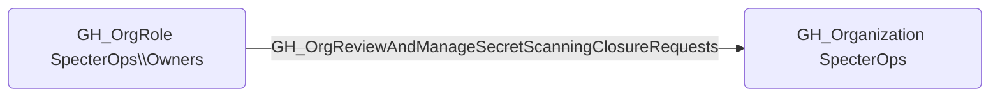

## Edge Schema

- Source: [GH_OrgRole](https://github.com/SpecterOps/bloodhound-docs/blob/main//opengraph/extensions/github/nodes/gh_orgrole)
- Destination: [GH_Organization](https://github.com/SpecterOps/bloodhound-docs/blob/main//opengraph/extensions/github/nodes/gh_organization)
- Traversable: ❌

## General Information

The non-traversable [GH_OrgReviewAndManageSecretScanningClosureRequests](https://github.com/SpecterOps/bloodhound-docs/blob/main//opengraph/extensions/github/edges/gh_orgreviewandmanagesecretscanningclosurerequests) edge represents that a role can review and manage secret scanning alert closure requests at the organization level. This edge is dynamically generated from custom organization role permissions discovered by the collector. Alert closure requests are part of the workflow for closing secret scanning alerts, and this permission controls who can approve or deny those requests. An attacker with this permission could approve closure requests to suppress alerts about actively leaked credentials, undermining the organization's secret scanning remediation process.

