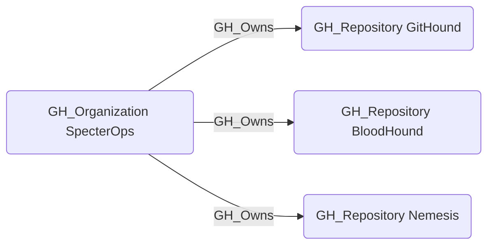

## Edge Schema

- Source: [GH_Organization](https://github.com/SpecterOps/bloodhound-docs/blob/main//opengraph/extensions/github/nodes/gh_organization)
- Destination: [GH_Repository](https://github.com/SpecterOps/bloodhound-docs/blob/main//opengraph/extensions/github/nodes/gh_repository)
- Traversable: ✅

## General Information

The traversable GH_Owns edge represents that an organization owns a repository. This edge establishes the foundation of the access control model by linking repositories to their owning organization. It is traversable because repository ownership is a critical relationship for understanding how organizational permissions cascade down to repository-level access, making it essential for attack path analysis.

