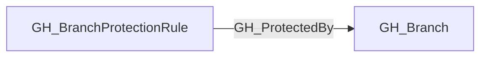

## Edge Schema

- Traversable: ❌

| Start | Kind | End |
|-------|-----------|-------|
| [GH_BranchProtectionRule](https://github.com/SpecterOps/bloodhound-docs/blob/main//opengraph/extensions/github/nodes/gh_branchprotectionrule) | GH_ProtectedBy | [GH_Branch](https://github.com/SpecterOps/bloodhound-docs/blob/main//opengraph/extensions/github/nodes/gh_branch) |

## General Information

The non-traversable GH_ProtectedBy edge represents that a branch protection rule applies to a specific branch. This edge links protection rules to the branches they govern. Understanding which protections apply to a branch is critical for determining the effective access model — protections such as required reviews, status checks, and push restrictions directly impact who can modify a branch. This edge is consumed by the computed branch-access edges to determine effective push access; the computed [GH_CanWriteBranch](https://github.com/SpecterOps/bloodhound-docs/blob/main//opengraph/extensions/github/edges/gh_canwritebranch) and [GH_CanEditProtection](https://github.com/SpecterOps/bloodhound-docs/blob/main//opengraph/extensions/github/edges/gh_caneditprotection) edges carry traversability instead.

## Edge Schema

| Source | Destination | Traversable |
| --- | --- | --- |
| [GH_BranchProtectionRule](https://github.com/SpecterOps/bloodhound-docs/blob/main//opengraph/extensions/github/nodes/gh_branchprotectionrule) | [GH_Branch](https://github.com/SpecterOps/bloodhound-docs/blob/main//opengraph/extensions/github/nodes/gh_branch) | `false` |

## Diagram

