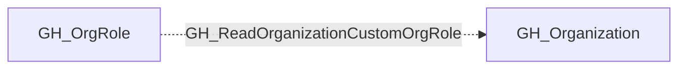

## Edge Schema

- Traversable: ❌

## General Information

The non-traversable GH_ReadOrganizationCustomOrgRole edge represents that a role can read custom organization role definitions. This edge is dynamically generated from custom organization role permissions discovered by the collector. Reading custom org role definitions allows a user to enumerate the permissions granted to each custom role, which provides reconnaissance value for understanding the organization's access control model and identifying roles with elevated privileges.

## Edge Schema

| Source | Destination | Traversable |
| --- | --- | --- |
| [GH_OrgRole](https://github.com/SpecterOps/bloodhound-docs/blob/main//opengraph/extensions/github/nodes/gh_orgrole) | [GH_Organization](https://github.com/SpecterOps/bloodhound-docs/blob/main//opengraph/extensions/github/nodes/gh_organization) | `false` |

## Diagram

