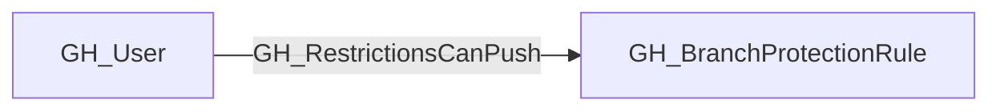
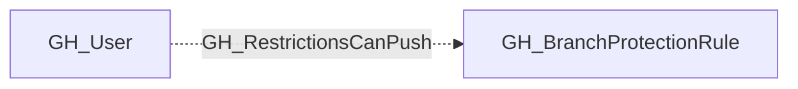

## Edge Schema

- Traversable: ❌

| Start | Kind | End |
|-------|-----------|-------|
| [GH_User](https://github.com/SpecterOps/bloodhound-docs/blob/main//opengraph/extensions/github/nodes/gh_user) | GH_RestrictionsCanPush | [GH_BranchProtectionRule](https://github.com/SpecterOps/bloodhound-docs/blob/main//opengraph/extensions/github/nodes/gh_branchprotectionrule) |

## General Information

The non-traversable GH_RestrictionsCanPush edge represents a per-actor allowance that grants push access through push restrictions on a branch protection rule. This edge identifies specific users or teams that are permitted to push to the protected branch even when push restrictions are active. This is security-relevant because push restrictions limit who can directly push to a branch, and actors with this allowance bypass that control. Unlike [GH_BypassPullRequestAllowances](https://github.com/SpecterOps/bloodhound-docs/blob/main//opengraph/extensions/github/edges/gh_bypasspullrequestallowances), this allowance is NOT suppressed by `enforce_admins` — listed actors retain push access regardless of admin enforcement settings.

## Edge Schema

| Source | Destination | Traversable |
| --- | --- | --- |
| [GH_User](https://github.com/SpecterOps/bloodhound-docs/blob/main//opengraph/extensions/github/nodes/gh_user) | [GH_BranchProtectionRule](https://github.com/SpecterOps/bloodhound-docs/blob/main//opengraph/extensions/github/nodes/gh_branchprotectionrule) | `false` |

## Diagram

