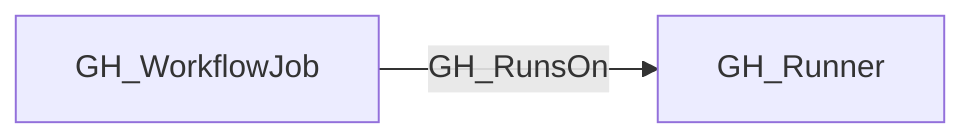
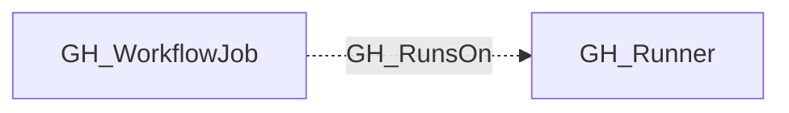

## Edge Schema

- Traversable: ❌

| Start | Kind | End |
|-------|-----------|-------|
| [GH_WorkflowJob](https://github.com/SpecterOps/bloodhound-docs/blob/main//opengraph/extensions/github/nodes/gh_workflowjob) | GH_RunsOn | [GH_Runner](https://github.com/SpecterOps/bloodhound-docs/blob/main//opengraph/extensions/github/nodes/gh_runner) |

## General Information

The non-traversable GH_RunsOn edge represents that a GitHub Actions workflow job can be scheduled on a self-hosted runner based on the job's statically declared `runs-on` selector and the runner topology visible to the containing repository.

This edge is schedulability evidence, not historical execution evidence. It does not mean that the job has previously executed on the runner. It means that the runner satisfies the job's static label and runner-group requirements and is reachable through the repository's current runner access policy.

The collector emits GH_RunsOn only for static selectors. Dynamic selectors that contain GitHub Actions expressions such as `${{ matrix.runner }}` or `${{ inputs.runner }}` are intentionally left unresolved in this first implementation.

## Edge Schema

| Source | Destination | Traversable |
| --- | --- | --- |
| [GH_WorkflowJob](https://github.com/SpecterOps/bloodhound-docs/blob/main//opengraph/extensions/github/nodes/gh_workflowjob) | [GH_Runner](https://github.com/SpecterOps/bloodhound-docs/blob/main//opengraph/extensions/github/nodes/gh_runner) | `false` |

## Diagram

