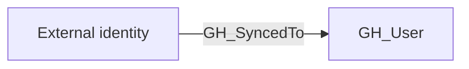

## Edge Schema

- Traversable: ✅

## General Information

The traversable GH_SyncedTo edge is a hybrid edge that maps an external IdP user to a GitHub user based on SCIM provisioning. This edge represents a confirmed identity linkage between an external identity provider and GitHub. It is traversable because compromising the IdP account provides a verified path to the corresponding GitHub account, making it a critical edge for cross-system attack path analysis. This edge enables analysts to trace access from enterprise identity providers like Azure AD, Okta, or PingOne into the GitHub environment.

## Edge Schema

| Source | Destination | Traversable |
| --- | --- | --- |
| `External identity` | [GH_User](https://github.com/SpecterOps/bloodhound-docs/blob/main//opengraph/extensions/github/nodes/gh_user) | `true` |

## Diagram

