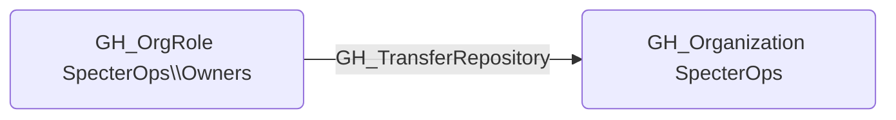

## Edge Schema

- Source: [GH_OrgRole](https://github.com/SpecterOps/bloodhound-docs/blob/main//opengraph/extensions/github/nodes/gh_orgrole)
- Destination: [GH_Organization](https://github.com/SpecterOps/bloodhound-docs/blob/main//opengraph/extensions/github/nodes/gh_organization)
- Traversable: ❌

## General Information

The non-traversable [GH_TransferRepository](https://github.com/SpecterOps/bloodhound-docs/blob/main//opengraph/extensions/github/edges/gh_transferrepository) edge represents that a role has the ability to transfer repositories to or from the organization. This permission is typically restricted to Owners, as transferring a repository can move it outside of the organization's security controls, branch protection rules, and audit logging. An attacker with this permission could transfer a repository to an organization they control, effectively exfiltrating the codebase and its associated secrets.

