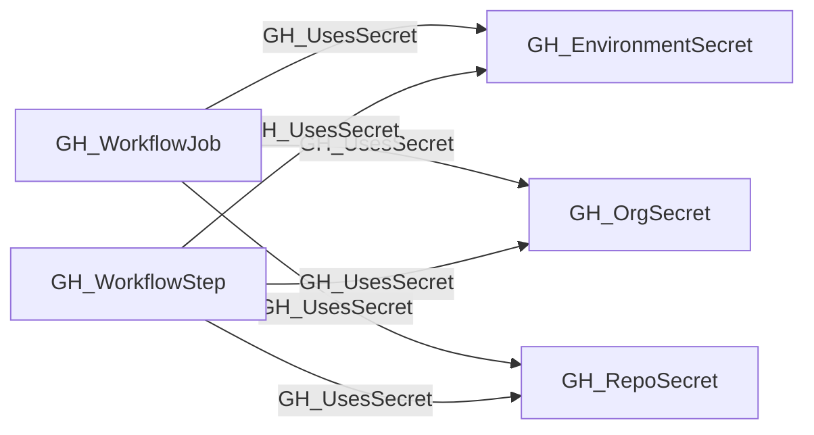

## Edge Schema

- Traversable: ❌

| Start | Kind | End |
|-------|-----------|-------|
| [GH_WorkflowStep](https://github.com/SpecterOps/bloodhound-docs/blob/main//opengraph/extensions/github/nodes/gh_workflowstep) | GH_UsesSecret | [GH_RepoSecret](https://github.com/SpecterOps/bloodhound-docs/blob/main//opengraph/extensions/github/nodes/gh_reposecret) |
| [GH_WorkflowStep](https://github.com/SpecterOps/bloodhound-docs/blob/main//opengraph/extensions/github/nodes/gh_workflowstep) | GH_UsesSecret | [GH_OrgSecret](https://github.com/SpecterOps/bloodhound-docs/blob/main//opengraph/extensions/github/nodes/gh_orgsecret) |
| [GH_WorkflowStep](https://github.com/SpecterOps/bloodhound-docs/blob/main//opengraph/extensions/github/nodes/gh_workflowstep) | GH_UsesSecret | [GH_EnvironmentSecret](https://github.com/SpecterOps/bloodhound-docs/blob/main//opengraph/extensions/github/nodes/gh_environmentsecret) |
| [GH_WorkflowJob](https://github.com/SpecterOps/bloodhound-docs/blob/main//opengraph/extensions/github/nodes/gh_workflowjob) | GH_UsesSecret | [GH_RepoSecret](https://github.com/SpecterOps/bloodhound-docs/blob/main//opengraph/extensions/github/nodes/gh_reposecret) |
| [GH_WorkflowJob](https://github.com/SpecterOps/bloodhound-docs/blob/main//opengraph/extensions/github/nodes/gh_workflowjob) | GH_UsesSecret | [GH_OrgSecret](https://github.com/SpecterOps/bloodhound-docs/blob/main//opengraph/extensions/github/nodes/gh_orgsecret) |
| [GH_WorkflowJob](https://github.com/SpecterOps/bloodhound-docs/blob/main//opengraph/extensions/github/nodes/gh_workflowjob) | GH_UsesSecret | [GH_EnvironmentSecret](https://github.com/SpecterOps/bloodhound-docs/blob/main//opengraph/extensions/github/nodes/gh_environmentsecret) |

## General Information

The non-traversable GH_UsesSecret edge links a workflow job or step to the secret it references via a `${{ secrets.NAME }}` expression. This edge reveals which secrets a workflow component can access at runtime, enabling analysts to trace the blast radius of a compromised workflow.

### Matching strategy

Edges use `match_by: property` with scope-specific matchers to disambiguate between secrets with the same name across repositories and environments:

- **[GH_RepoSecret](https://github.com/SpecterOps/bloodhound-docs/blob/main//opengraph/extensions/github/nodes/gh_reposecret)** is matched by `name` + `repository_id` (the GitHub node_id of the repository).
- **[GH_OrgSecret](https://github.com/SpecterOps/bloodhound-docs/blob/main//opengraph/extensions/github/nodes/gh_orgsecret)** is matched by `name` + `environmentid` (the node_id of the organization, which acts as the org-level secret scope).
- **[GH_EnvironmentSecret](https://github.com/SpecterOps/bloodhound-docs/blob/main//opengraph/extensions/github/nodes/gh_environmentsecret)** is matched by `name` + `deployment_environment_name` + `repository_id` when the parent job targets a concrete environment name.

This means one `${{ secrets.MY_SECRET }}` expression in a workflow can produce edges to repo-level, org-level, and environment-level secrets that share the same name in the applicable scopes. The environment-level edge is only emitted when the workflow job references a literal environment name rather than a dynamic expression.

### Context property

The edge carries a `context` property indicating where the reference was found:
- `with` — inside a `with:` input block of a `uses:` action step
- `env` — inside the step's `env:` block
- `run` — inline within a `run:` shell script

## Edge Schema

| Source | Destination | Traversable |
| --- | --- | --- |
| [GH_WorkflowJob](https://github.com/SpecterOps/bloodhound-docs/blob/main//opengraph/extensions/github/nodes/gh_workflowjob) | [GH_EnvironmentSecret](https://github.com/SpecterOps/bloodhound-docs/blob/main//opengraph/extensions/github/nodes/gh_environmentsecret) | `false` |
| [GH_WorkflowJob](https://github.com/SpecterOps/bloodhound-docs/blob/main//opengraph/extensions/github/nodes/gh_workflowjob) | [GH_OrgSecret](https://github.com/SpecterOps/bloodhound-docs/blob/main//opengraph/extensions/github/nodes/gh_orgsecret) | `false` |
| [GH_WorkflowJob](https://github.com/SpecterOps/bloodhound-docs/blob/main//opengraph/extensions/github/nodes/gh_workflowjob) | [GH_RepoSecret](https://github.com/SpecterOps/bloodhound-docs/blob/main//opengraph/extensions/github/nodes/gh_reposecret) | `false` |
| [GH_WorkflowStep](https://github.com/SpecterOps/bloodhound-docs/blob/main//opengraph/extensions/github/nodes/gh_workflowstep) | [GH_EnvironmentSecret](https://github.com/SpecterOps/bloodhound-docs/blob/main//opengraph/extensions/github/nodes/gh_environmentsecret) | `false` |
| [GH_WorkflowStep](https://github.com/SpecterOps/bloodhound-docs/blob/main//opengraph/extensions/github/nodes/gh_workflowstep) | [GH_OrgSecret](https://github.com/SpecterOps/bloodhound-docs/blob/main//opengraph/extensions/github/nodes/gh_orgsecret) | `false` |
| [GH_WorkflowStep](https://github.com/SpecterOps/bloodhound-docs/blob/main//opengraph/extensions/github/nodes/gh_workflowstep) | [GH_RepoSecret](https://github.com/SpecterOps/bloodhound-docs/blob/main//opengraph/extensions/github/nodes/gh_reposecret) | `false` |

## Diagram

