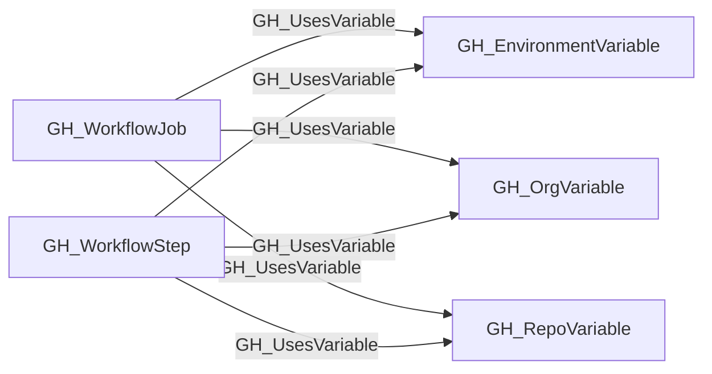

## Edge Schema

- Traversable: ❌

| Start | Kind | End |
|-------|-----------|-------|
| [GH_WorkflowStep](https://github.com/SpecterOps/bloodhound-docs/blob/main//opengraph/extensions/github/nodes/gh_workflowstep) | GH_UsesVariable | [GH_RepoVariable](https://github.com/SpecterOps/bloodhound-docs/blob/main//opengraph/extensions/github/nodes/gh_repovariable) |
| [GH_WorkflowStep](https://github.com/SpecterOps/bloodhound-docs/blob/main//opengraph/extensions/github/nodes/gh_workflowstep) | GH_UsesVariable | [GH_OrgVariable](https://github.com/SpecterOps/bloodhound-docs/blob/main//opengraph/extensions/github/nodes/gh_orgvariable) |
| [GH_WorkflowStep](https://github.com/SpecterOps/bloodhound-docs/blob/main//opengraph/extensions/github/nodes/gh_workflowstep) | GH_UsesVariable | [GH_EnvironmentVariable](https://github.com/SpecterOps/bloodhound-docs/blob/main//opengraph/extensions/github/nodes/gh_environmentvariable) |
| [GH_WorkflowJob](https://github.com/SpecterOps/bloodhound-docs/blob/main//opengraph/extensions/github/nodes/gh_workflowjob) | GH_UsesVariable | [GH_RepoVariable](https://github.com/SpecterOps/bloodhound-docs/blob/main//opengraph/extensions/github/nodes/gh_repovariable) |
| [GH_WorkflowJob](https://github.com/SpecterOps/bloodhound-docs/blob/main//opengraph/extensions/github/nodes/gh_workflowjob) | GH_UsesVariable | [GH_OrgVariable](https://github.com/SpecterOps/bloodhound-docs/blob/main//opengraph/extensions/github/nodes/gh_orgvariable) |
| [GH_WorkflowJob](https://github.com/SpecterOps/bloodhound-docs/blob/main//opengraph/extensions/github/nodes/gh_workflowjob) | GH_UsesVariable | [GH_EnvironmentVariable](https://github.com/SpecterOps/bloodhound-docs/blob/main//opengraph/extensions/github/nodes/gh_environmentvariable) |

## General Information

The non-traversable GH_UsesVariable edge links a workflow job or step to the variable it references via a `${{ vars.NAME }}` expression. This edge maps variable consumption within workflows. Unlike secrets, variable values are readable via the API, making them lower sensitivity — but they can still influence workflow behavior (e.g., controlling target environments or feature flags).

### Matching strategy

Edges use `match_by: property` with scope-specific matchers to disambiguate between variables with the same name across repositories and environments:

- **[GH_RepoVariable](https://github.com/SpecterOps/bloodhound-docs/blob/main//opengraph/extensions/github/nodes/gh_repovariable)** is matched by `name` + `repository_id` (the GitHub node_id of the repository).
- **[GH_OrgVariable](https://github.com/SpecterOps/bloodhound-docs/blob/main//opengraph/extensions/github/nodes/gh_orgvariable)** is matched by `name` + `environmentid` (the node_id of the organization, which acts as the org-level variable scope).
- **[GH_EnvironmentVariable](https://github.com/SpecterOps/bloodhound-docs/blob/main//opengraph/extensions/github/nodes/gh_environmentvariable)** is matched by `name` + `deployment_environment_name` + `repository_id` when the parent job targets a concrete environment name.

This means one `${{ vars.MY_VAR }}` expression can produce edges to repo-level, org-level, and environment-level variables that share the same name in the applicable scopes. The environment-level edge is only emitted when the workflow job references a literal environment name rather than a dynamic expression.

### Context property

The edge carries a `context` property indicating where the reference was found:
- `with` — inside a `with:` input block of a `uses:` action step
- `env` — inside the step's `env:` block
- `run` — inline within a `run:` shell script

## Edge Schema

| Source | Destination | Traversable |
| --- | --- | --- |
| [GH_WorkflowJob](https://github.com/SpecterOps/bloodhound-docs/blob/main//opengraph/extensions/github/nodes/gh_workflowjob) | [GH_EnvironmentVariable](https://github.com/SpecterOps/bloodhound-docs/blob/main//opengraph/extensions/github/nodes/gh_environmentvariable) | `false` |
| [GH_WorkflowJob](https://github.com/SpecterOps/bloodhound-docs/blob/main//opengraph/extensions/github/nodes/gh_workflowjob) | [GH_OrgVariable](https://github.com/SpecterOps/bloodhound-docs/blob/main//opengraph/extensions/github/nodes/gh_orgvariable) | `false` |
| [GH_WorkflowJob](https://github.com/SpecterOps/bloodhound-docs/blob/main//opengraph/extensions/github/nodes/gh_workflowjob) | [GH_RepoVariable](https://github.com/SpecterOps/bloodhound-docs/blob/main//opengraph/extensions/github/nodes/gh_repovariable) | `false` |
| [GH_WorkflowStep](https://github.com/SpecterOps/bloodhound-docs/blob/main//opengraph/extensions/github/nodes/gh_workflowstep) | [GH_EnvironmentVariable](https://github.com/SpecterOps/bloodhound-docs/blob/main//opengraph/extensions/github/nodes/gh_environmentvariable) | `false` |
| [GH_WorkflowStep](https://github.com/SpecterOps/bloodhound-docs/blob/main//opengraph/extensions/github/nodes/gh_workflowstep) | [GH_OrgVariable](https://github.com/SpecterOps/bloodhound-docs/blob/main//opengraph/extensions/github/nodes/gh_orgvariable) | `false` |
| [GH_WorkflowStep](https://github.com/SpecterOps/bloodhound-docs/blob/main//opengraph/extensions/github/nodes/gh_workflowstep) | [GH_RepoVariable](https://github.com/SpecterOps/bloodhound-docs/blob/main//opengraph/extensions/github/nodes/gh_repovariable) | `false` |

## Diagram

