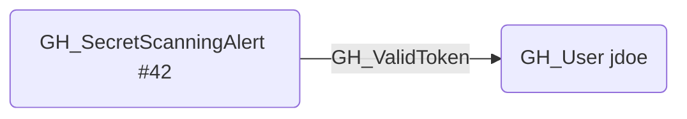

## Edge Schema

- Source: [GH_SecretScanningAlert](https://github.com/SpecterOps/bloodhound-docs/blob/main//opengraph/extensions/github/nodes/gh_secretscanningalert)
- Destination: [GH_User](https://github.com/SpecterOps/bloodhound-docs/blob/main//opengraph/extensions/github/nodes/gh_user)
- Traversable: ✅

## General Information

The traversable GH_ValidToken edge represents a secret scanning alert that contains a valid, active GitHub Personal Access Token belonging to a specific user. This edge is only emitted when the alert's state is `open`, the secret type is `github_personal_access_token`, and the token is confirmed valid by calling the GitHub API. This edge is traversable because possessing the leaked token grants the ability to act as the token's owner, effectively compromising that user's identity and all permissions granted to the token.

