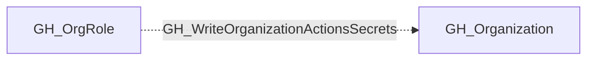

## Edge Schema

- Traversable: ❌

## General Information

The non-traversable GH_WriteOrganizationActionsSecrets edge represents that a role can write organization-level GitHub Actions secrets. This edge is dynamically generated from custom organization role permissions discovered by the collector. Organization-level secrets are available to workflows across multiple repositories and often contain credentials for external systems such as cloud providers, package registries, and deployment targets. An attacker with this permission could overwrite existing secrets to inject malicious credentials or create new secrets to facilitate lateral movement.

## Edge Schema

| Source | Destination | Traversable |
| --- | --- | --- |
| [GH_OrgRole](https://github.com/SpecterOps/bloodhound-docs/blob/main//opengraph/extensions/github/nodes/gh_orgrole) | [GH_Organization](https://github.com/SpecterOps/bloodhound-docs/blob/main//opengraph/extensions/github/nodes/gh_organization) | `false` |

## Diagram

