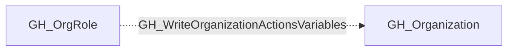

## Edge Schema

- Traversable: ❌

## General Information

The non-traversable GH_WriteOrganizationActionsVariables edge represents that a role can write organization-level GitHub Actions variables. This edge is dynamically generated from custom organization role permissions discovered by the collector. Organization-level variables are available to workflows across multiple repositories and often contain configuration values such as environment URLs, feature flags, and service endpoints. An attacker with this permission could overwrite existing variables to redirect workflows to malicious endpoints or alter application behavior.

## Edge Schema

| Source | Destination | Traversable |
| --- | --- | --- |
| [GH_OrgRole](https://github.com/SpecterOps/bloodhound-docs/blob/main//opengraph/extensions/github/nodes/gh_orgrole) | [GH_Organization](https://github.com/SpecterOps/bloodhound-docs/blob/main//opengraph/extensions/github/nodes/gh_organization) | `false` |

## Diagram

