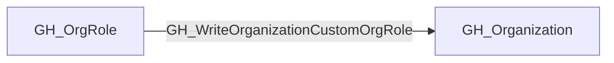

## Edge Schema

- Traversable: ✅

## General Information

The traversable GH_WriteOrganizationCustomOrgRole edge represents that a role can create or modify custom organization role definitions. This edge is dynamically generated from custom organization role permissions discovered by the collector. Modifying organization role definitions can escalate privileges because an attacker could add permissions to an existing custom role that is already assigned to their account, including setting the base_role to inherit all_repo_admin. Since this permission can only belong to custom organization roles, the user necessarily holds the role they can modify — guaranteeing a self-escalation path. This makes it a Tier Zero privilege escalation vector.

## Edge Schema

| Source | Destination | Traversable |
| --- | --- | --- |
| [GH_OrgRole](https://github.com/SpecterOps/bloodhound-docs/blob/main//opengraph/extensions/github/nodes/gh_orgrole) | [GH_Organization](https://github.com/SpecterOps/bloodhound-docs/blob/main//opengraph/extensions/github/nodes/gh_organization) | `true` |

## Diagram

