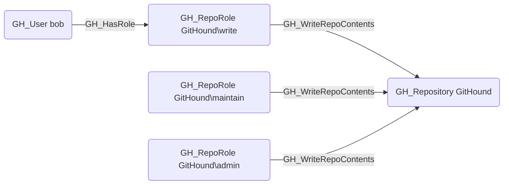

## Edge Schema

- Source: [GH_RepoRole](https://github.com/SpecterOps/bloodhound-docs/blob/main//opengraph/extensions/github/nodes/gh_reporole)
- Destination: [GH_Repository](https://github.com/SpecterOps/bloodhound-docs/blob/main//opengraph/extensions/github/nodes/gh_repository)
- Traversable: ❌

## General Information

The non-traversable [GH_WriteRepoContents](https://github.com/SpecterOps/bloodhound-docs/blob/main//opengraph/extensions/github/edges/gh_writerepocontents) edge represents a role's ability to push commits to the repository. This permission is available to Write, Maintain, and Admin roles. Pushing code can modify application behavior and introduce vulnerabilities, making this a security-significant edge. However, this edge represents only the raw permission; actual branch push capability is determined by the computed [GH_CanWriteBranch](https://github.com/SpecterOps/bloodhound-docs/blob/main//opengraph/extensions/github/edges/gh_canwritebranch) edge, which factors in branch protection rules and push restrictions.

