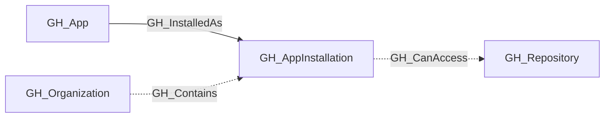
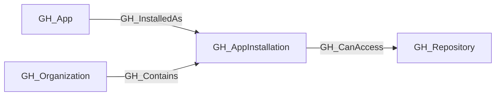

## General Information

Represents a GitHub App installed on an organization. App installations have specific permissions and can be scoped to all repositories or a selection of repositories. The permissions granted to the app are captured as a JSON string in the properties.

Each installation is linked to its parent [GH_App](https://github.com/SpecterOps/bloodhound-docs/blob/main//opengraph/extensions/github/nodes/gh_app) via a [GH_InstalledAs](https://github.com/SpecterOps/bloodhound-docs/blob/main//opengraph/extensions/github/edges/gh_installedas) edge. For installations with `repository_selection` set to `all`, [GH_CanAccess](https://github.com/SpecterOps/bloodhound-docs/blob/main//opengraph/extensions/github/edges/gh_canaccess) edges are created to every repository in the organization. For installations with `repository_selection` set to `selected`, repository-level edges cannot be enumerated with a PAT (requires app installation token authentication).

## Properties

| Property | Type | Description |
| --- | --- | --- |
| `name` | `string` | The node name used for matching and display. |
| `displayname` | `string` | The human-readable display name. |
| `environmentid` | `string` | The identifier of the GitHub environment where this node was collected. |
| `last_seen` | `datetime` | The timestamp when this node was last observed during collection. |
| `node_id` | `string` | The stable identifier used as the OpenGraph node ID; this is the native GitHub node ID where available. |
| `id` | `integer` | The GitHub installation ID. |
| `app_id` | `integer` | The GitHub App's numeric ID (shared across all installations of the same app). |
| `app_slug` | `string` | The app's URL-friendly slug identifier. |
| `description` | `string` | The app's description. |
| `html_url` | `string` | URL to the app's GitHub page. |
| `access_tokens_url` | `string` | API URL to create installation access tokens. |
| `repositories_url` | `string` | API URL to list repositories accessible to this installation. |
| `repository_selection` | `string` | Whether the app has access to `all` repositories or `selected` repositories. |
| `target_type` | `string` | The target type of the installation (e.g., `Organization`). |
| `permissions` | `string` | JSON string of the permissions granted to the app (e.g., `{"contents": "read", "metadata": "read"}`). |
| `events` | `string` | JSON string of the webhook events the app subscribes to. |
| `created_at` | `datetime` | When the app was installed. |
| `updated_at` | `datetime` | When the installation was last updated. |
| `suspended_at` | `datetime` | When the installation was suspended, if applicable. |
| `environment_name` | `string` | The name of the environment (GitHub organization) where the app is installed. |
| `query_repositories` | `string` | Query for repositories. |
| `query_app` | `string` | Query for app. |

## Diagram

## Edges

<Note>
The tables below list edges defined by the GitHub extension only. Additional edges to or from this node may be created by other extensions.
</Note>

### Inbound Edges

| Edge Type | Source Node Types | Traversable |
| --------- | ----------------- | ----------- |
| [GH_Contains](https://github.com/SpecterOps/bloodhound-docs/blob/main//opengraph/extensions/github/edges/gh_contains) | [GH_Organization](https://github.com/SpecterOps/bloodhound-docs/blob/main//opengraph/extensions/github/nodes/gh_organization) | ❌ |
| [GH_InstalledAs](https://github.com/SpecterOps/bloodhound-docs/blob/main//opengraph/extensions/github/edges/gh_installedas) | [GH_App](https://github.com/SpecterOps/bloodhound-docs/blob/main//opengraph/extensions/github/nodes/gh_app) | ✅ |

### Outbound Edges

| Edge Type | Destination Node Types | Traversable |
| --------- | ---------------------- | ----------- |
| [GH_CanAccess](https://github.com/SpecterOps/bloodhound-docs/blob/main//opengraph/extensions/github/edges/gh_canaccess) | [GH_Repository](https://github.com/SpecterOps/bloodhound-docs/blob/main//opengraph/extensions/github/nodes/gh_repository) | ❌ |

## Properties

| Property | Type | Description |
| -------- | ---- | ----------- |
| `name` | `str` | - |
| `displayname` | `str` | - |
| `environmentid` | `str` | - |
| `last_seen` | `datetime` | - |
| `node_id` | `str` | - |
| `id` | `int \| None` | The GitHub installation ID. |
| `app_id` | `int \| None` | The GitHub App's numeric ID (shared across all installations of the same app). |
| `app_slug` | `str \| None` | The app's URL-friendly slug identifier. |
| `description` | `str \| None` | The app's description. |
| `html_url` | `str \| None` | URL to the app's GitHub page. |
| `access_tokens_url` | `str \| None` | API URL to create installation access tokens. |
| `repositories_url` | `str \| None` | API URL to list repositories accessible to this installation. |
| `repository_selection` | `str \| None` | Whether the app has access to `all` repositories or `selected` repositories. |
| `target_type` | `str \| None` | The target type of the installation (e.g., `Organization`). |
| `permissions` | `str \| None` | JSON string of the permissions granted to the app (e.g., `{"contents": "read", "metadata": "read"}`). |
| `events` | `str \| None` | JSON string of the webhook events the app subscribes to. |
| `created_at` | `datetime \| None` | When the app was installed. |
| `updated_at` | `datetime \| None` | When the installation was last updated. |
| `suspended_at` | `datetime \| None` | When the installation was suspended, if applicable. |
| `environment_name` | `str \| None` | The name of the environment (GitHub organization) where the app is installed. |
| `query_repositories` | `str \| None` | Query for repositories. |
| `query_app` | `str \| None` | Query for app. |
