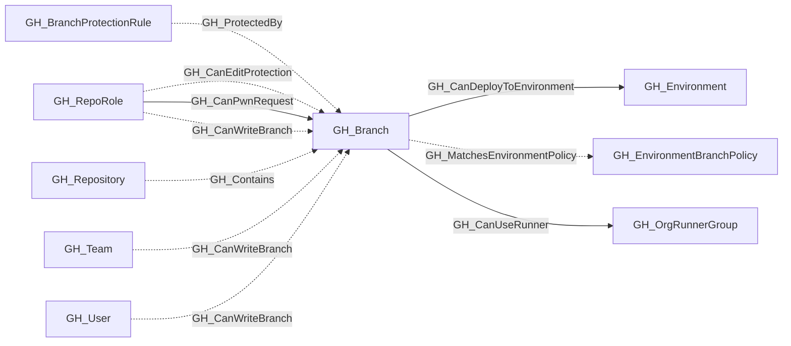
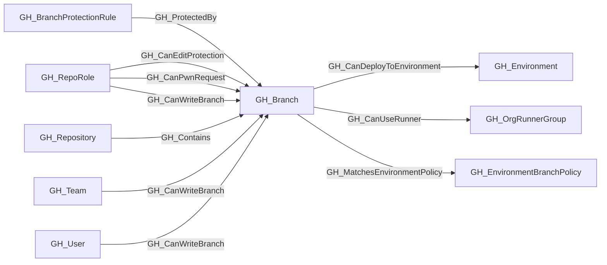

## General Information

Represents a Git branch within a repository. Branch nodes capture basic branch information and whether the branch is protected. Protection rule details are stored in separate [GH_BranchProtectionRule](https://github.com/SpecterOps/bloodhound-docs/blob/main//opengraph/extensions/github/nodes/gh_branchprotectionrule) nodes, linked via [GH_ProtectedBy](https://github.com/SpecterOps/bloodhound-docs/blob/main//opengraph/extensions/github/edges/gh_protectedby) edges.

## Properties

| Property | Type | Description |
| --- | --- | --- |
| `name` | `string` | The node name used for matching and display. |
| `displayname` | `string` | The human-readable display name. |
| `environmentid` | `string` | The identifier of the GitHub environment where this node was collected. |
| `last_seen` | `datetime` | The timestamp when this node was last observed during collection. |
| `node_id` | `string` | The stable identifier used as the OpenGraph node ID; this is the native GitHub node ID where available. |
| `collected` | `boolean` | Collected/generated by OpenHound. |
| `short_name` | `string` | The branch reference name (e.g., `main`). |
| `commit_hash` | `string` | The commit hash property. |
| `protected` | `boolean` | Whether the branch has a protection rule. |
| `repository_name` | `string` | The repository name property. |
| `repository_id` | `string` | The repository id property. |
| `environment_name` | `string` | The name of the environment (GitHub organization). |
| `query_branch_write` | `string` | Query for branch write. |

## Diagram

## Edges

<Note>
The tables below list edges defined by the GitHub extension only. Additional edges to or from this node may be created by other extensions.
</Note>

### Inbound Edges

| Edge Type | Source Node Types | Traversable |
| --------- | ----------------- | ----------- |
| [GH_CanEditProtection](https://github.com/SpecterOps/bloodhound-docs/blob/main//opengraph/extensions/github/edges/gh_caneditprotection) | [GH_RepoRole](https://github.com/SpecterOps/bloodhound-docs/blob/main//opengraph/extensions/github/nodes/gh_reporole) | ✅ |
| [GH_CanPwnRequest](https://github.com/SpecterOps/bloodhound-docs/blob/main//opengraph/extensions/github/edges/gh_canpwnrequest) | [GH_RepoRole](https://github.com/SpecterOps/bloodhound-docs/blob/main//opengraph/extensions/github/nodes/gh_reporole) | ✅ |
| [GH_CanWriteBranch](https://github.com/SpecterOps/bloodhound-docs/blob/main//opengraph/extensions/github/edges/gh_canwritebranch) | [GH_RepoRole](https://github.com/SpecterOps/bloodhound-docs/blob/main//opengraph/extensions/github/nodes/gh_reporole), [GH_Team](https://github.com/SpecterOps/bloodhound-docs/blob/main//opengraph/extensions/github/nodes/gh_team), [GH_User](https://github.com/SpecterOps/bloodhound-docs/blob/main//opengraph/extensions/github/nodes/gh_user) | ✅ |
| [GH_Contains](https://github.com/SpecterOps/bloodhound-docs/blob/main//opengraph/extensions/github/edges/gh_contains) | [GH_Repository](https://github.com/SpecterOps/bloodhound-docs/blob/main//opengraph/extensions/github/nodes/gh_repository) | ❌ |
| [GH_ProtectedBy](https://github.com/SpecterOps/bloodhound-docs/blob/main//opengraph/extensions/github/edges/gh_protectedby) | [GH_BranchProtectionRule](https://github.com/SpecterOps/bloodhound-docs/blob/main//opengraph/extensions/github/nodes/gh_branchprotectionrule) | ❌ |

### Outbound Edges

| Edge Type | Destination Node Types | Traversable |
| --------- | ---------------------- | ----------- |
| [GH_CanDeployToEnvironment](https://github.com/SpecterOps/bloodhound-docs/blob/main//opengraph/extensions/github/edges/gh_candeploytoenvironment) | [GH_Environment](https://github.com/SpecterOps/bloodhound-docs/blob/main//opengraph/extensions/github/nodes/gh_environment) | ✅ |
| [GH_CanUseRunner](https://github.com/SpecterOps/bloodhound-docs/blob/main//opengraph/extensions/github/edges/gh_canuserunner) | [GH_OrgRunnerGroup](https://github.com/SpecterOps/bloodhound-docs/blob/main//opengraph/extensions/github/nodes/gh_orgrunnergroup) | ✅ |
| [GH_MatchesEnvironmentPolicy](https://github.com/SpecterOps/bloodhound-docs/blob/main//opengraph/extensions/github/edges/gh_matchesenvironmentpolicy) | [GH_EnvironmentBranchPolicy](https://github.com/SpecterOps/bloodhound-docs/blob/main//opengraph/extensions/github/nodes/gh_environmentbranchpolicy) | ❌ |

## Properties

| Property | Type | Description |
| -------- | ---- | ----------- |
| `name` | `str` | - |
| `displayname` | `str` | - |
| `environmentid` | `str` | - |
| `last_seen` | `datetime` | - |
| `node_id` | `str` | - |
| `collected` | `bool` | Collected/generated by OpenHound |
| `short_name` | `str \| None` | The branch reference name (e.g., `main`). |
| `commit_hash` | `str \| None` | The commit hash property. |
| `protected` | `bool` | Whether the branch has a protection rule. |
| `repository_name` | `str \| None` | The repository name property. |
| `repository_id` | `str \| None` | The repository id property. |
| `environment_name` | `str \| None` | The name of the environment (GitHub organization). |
| `query_branch_write` | `str \| None` | Query for branch write. |
