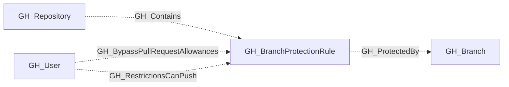
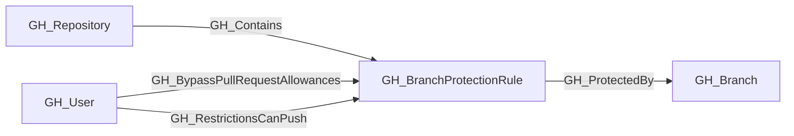

## General Information

Represents a branch protection rule configured on a GitHub repository. Protection rules define requirements that must be met before changes can be merged to matching branches, such as required reviews, status checks, and restrictions on who can push.

A single protection rule can apply to multiple branches via pattern matching (e.g., `main`, `release/*`).

## Security Considerations

Branch protection rules are critical security controls. Key settings to review:

- **enforce_admins**: Enforces merge-gate controls (PR reviews, lock branch) for admins and users with `bypass_branch_protection`. Does **not** enforce push-gate controls (`push_restrictions`) for admins or users with `push_protected_branch`.
- **required_pull_request_reviews**: Blocks direct pushes to existing protected branches. Bypassed by [GH_BypassBranchProtection](https://github.com/SpecterOps/bloodhound-docs/blob/main//opengraph/extensions/github/edges/gh_bypassbranchprotection) and [GH_BypassPullRequestAllowances](https://github.com/SpecterOps/bloodhound-docs/blob/main//opengraph/extensions/github/edges/gh_bypasspullrequestallowances) (both suppressed by `enforce_admins`).
- **push_restrictions**: Restricts who can push. Bypassed by [GH_PushProtectedBranch](https://github.com/SpecterOps/bloodhound-docs/blob/main//opengraph/extensions/github/edges/gh_pushprotectedbranch), [GH_AdminTo](https://github.com/SpecterOps/bloodhound-docs/blob/main//opengraph/extensions/github/edges/gh_adminto), and [GH_RestrictionsCanPush](https://github.com/SpecterOps/bloodhound-docs/blob/main//opengraph/extensions/github/edges/gh_restrictionscanpush) (none suppressed by `enforce_admins`).
- **blocks_creations**: Restricts new branch creation when `push_restrictions` is also `true`. Same bypass vectors as `push_restrictions`. Silently reverts to `false` if `push_restrictions` is disabled.
- **lock_branch**: Makes branch read-only. Bypassed by [GH_BypassBranchProtection](https://github.com/SpecterOps/bloodhound-docs/blob/main//opengraph/extensions/github/edges/gh_bypassbranchprotection) (suppressed by `enforce_admins`).
- **require_code_owner_reviews**: If `false`, changes to critical paths may not require owner approval.
- **allows_force_pushes**: Controls whether history rewrites are allowed. Does **not** grant push access — it is not a bypass mechanism.
- **allows_deletions**: If `true`, branches can be deleted (potentially losing code).

### Secret Exfiltration Mitigation

The only branch protection configuration that blocks the write-access → workflow → secrets exfiltration attack path is `push_restrictions` + `blocks_creations` on a `*` pattern rule. However, users with [GH_PushProtectedBranch](https://github.com/SpecterOps/bloodhound-docs/blob/main//opengraph/extensions/github/edges/gh_pushprotectedbranch), [GH_AdminTo](https://github.com/SpecterOps/bloodhound-docs/blob/main//opengraph/extensions/github/edges/gh_adminto), [GH_RestrictionsCanPush](https://github.com/SpecterOps/bloodhound-docs/blob/main//opengraph/extensions/github/edges/gh_restrictionscanpush), or [GH_EditRepoProtections](https://github.com/SpecterOps/bloodhound-docs/blob/main//opengraph/extensions/github/edges/gh_editrepoprotections) can bypass this control.

For complete analysis, see [BloodHound Docs: GitHub - Mitigating Controls](https://github.com/SpecterOps/bloodhound-docs/blob/main//opengraph/extensions/github/mitigating-controls).

### Identifying Bypass Actors

Use these edges to identify users and teams with elevated branch permissions:

- [GH_BypassPullRequestAllowances](https://github.com/SpecterOps/bloodhound-docs/blob/main//opengraph/extensions/github/edges/gh_bypasspullrequestallowances) — can bypass PR requirements on a specific rule (PR reviews only)
- [GH_RestrictionsCanPush](https://github.com/SpecterOps/bloodhound-docs/blob/main//opengraph/extensions/github/edges/gh_restrictionscanpush) — can push despite push restrictions on a specific rule
- [GH_BypassBranchProtection](https://github.com/SpecterOps/bloodhound-docs/blob/main//opengraph/extensions/github/edges/gh_bypassbranchprotection) — repo-wide bypass of merge-gate controls (PR reviews + lock branch)
- [GH_PushProtectedBranch](https://github.com/SpecterOps/bloodhound-docs/blob/main//opengraph/extensions/github/edges/gh_pushprotectedbranch) — repo-wide bypass of push-gate controls (push restrictions + blocks creations)
- [GH_EditRepoProtections](https://github.com/SpecterOps/bloodhound-docs/blob/main//opengraph/extensions/github/edges/gh_editrepoprotections) — can remove/modify protection rules entirely

## Properties

| Property | Type | Description |
| --- | --- | --- |
| `name` | `string` | The node name used for matching and display. |
| `displayname` | `string` | The human-readable display name. |
| `environmentid` | `string` | The identifier of the GitHub environment where this node was collected. |
| `last_seen` | `datetime` | The timestamp when this node was last observed during collection. |
| `node_id` | `string` | The stable identifier used as the OpenGraph node ID; this is the native GitHub node ID where available. |
| `pattern` | `string` | The branch name pattern this rule applies to (e.g., `main`, `release/*`). |
| `repository_name` | `string` | The repository name property. |
| `repository_id` | `string` | The repository id property. |
| `environment_name` | `string` | The GitHub organization login name. |
| `enforce_admins` | `boolean` | Whether branch protection rules are enforced for administrators. |
| `lock_branch` | `boolean` | Whether the branch is locked (read-only). |
| `blocks_creations` | `boolean` | Whether creating branches matching this pattern is restricted. Only effective when `push_restrictions` is also `true`; silently reverts to `false` otherwise. |
| `required_pull_request_reviews` | `boolean` | Whether pull request reviews are required before merging. |
| `required_approving_review_count` | `integer` | The number of approving reviews required. |
| `require_code_owner_reviews` | `boolean` | Whether reviews from code owners are required. |
| `require_last_push_approval` | `boolean` | Whether the last push must be approved by someone other than the pusher. |
| `push_restrictions` | `boolean` | Whether push access is restricted to specific users/teams. |
| `requires_status_checks` | `boolean` | Whether status checks must pass before merging. |
| `requires_strict_status_checks` | `boolean` | Whether branches must be up to date with the base branch before merging. |
| `dismisses_stale_reviews` | `boolean` | Whether new commits dismiss previously approved reviews. |
| `allows_force_pushes` | `boolean` | Whether force pushes are allowed to matching branches. |
| `allows_deletions` | `boolean` | Whether matching branches can be deleted. |
| `query_user_exceptions` | `string` | Query for user exceptions. |
| `query_branches` | `string` | Query for branches. |

## Diagram

## Edges

<Note>
The tables below list edges defined by the GitHub extension only. Additional edges to or from this node may be created by other extensions.
</Note>

### Inbound Edges

| Edge Type | Source Node Types | Traversable |
| --------- | ----------------- | ----------- |
| [GH_BypassPullRequestAllowances](https://github.com/SpecterOps/bloodhound-docs/blob/main//opengraph/extensions/github/edges/gh_bypasspullrequestallowances) | [GH_User](https://github.com/SpecterOps/bloodhound-docs/blob/main//opengraph/extensions/github/nodes/gh_user) | ❌ |
| [GH_Contains](https://github.com/SpecterOps/bloodhound-docs/blob/main//opengraph/extensions/github/edges/gh_contains) | [GH_Repository](https://github.com/SpecterOps/bloodhound-docs/blob/main//opengraph/extensions/github/nodes/gh_repository) | ❌ |
| [GH_RestrictionsCanPush](https://github.com/SpecterOps/bloodhound-docs/blob/main//opengraph/extensions/github/edges/gh_restrictionscanpush) | [GH_User](https://github.com/SpecterOps/bloodhound-docs/blob/main//opengraph/extensions/github/nodes/gh_user) | ❌ |

### Outbound Edges

| Edge Type | Destination Node Types | Traversable |
| --------- | ---------------------- | ----------- |
| [GH_ProtectedBy](https://github.com/SpecterOps/bloodhound-docs/blob/main//opengraph/extensions/github/edges/gh_protectedby) | [GH_Branch](https://github.com/SpecterOps/bloodhound-docs/blob/main//opengraph/extensions/github/nodes/gh_branch) | ❌ |

## Properties

| Property | Type | Description |
| -------- | ---- | ----------- |
| `name` | `str` | - |
| `displayname` | `str` | - |
| `environmentid` | `str` | - |
| `last_seen` | `datetime` | - |
| `node_id` | `str` | - |
| `pattern` | `str \| None` | The branch name pattern this rule applies to (e.g., `main`, `release/*`). |
| `repository_name` | `str \| None` | The repository name property. |
| `repository_id` | `str \| None` | The repository id property. |
| `environment_name` | `str \| None` | The GitHub organization login name. |
| `enforce_admins` | `bool \| None` | Whether branch protection rules are enforced for administrators. |
| `lock_branch` | `bool \| None` | Whether the branch is locked (read-only). |
| `blocks_creations` | `bool \| None` | Whether creating branches matching this pattern is restricted. Only effective when `push_restrictions` is also `true`; silently reverts to `false` otherwise. |
| `required_pull_request_reviews` | `bool \| None` | Whether pull request reviews are required before merging. |
| `required_approving_review_count` | `int \| None` | The number of approving reviews required. |
| `require_code_owner_reviews` | `bool \| None` | Whether reviews from code owners are required. |
| `require_last_push_approval` | `bool \| None` | Whether the last push must be approved by someone other than the pusher. |
| `push_restrictions` | `bool \| None` | Whether push access is restricted to specific users/teams. |
| `requires_status_checks` | `bool \| None` | Whether status checks must pass before merging. |
| `requires_strict_status_checks` | `bool \| None` | Whether branches must be up to date with the base branch before merging. |
| `dismisses_stale_reviews` | `bool \| None` | Whether new commits dismiss previously approved reviews. |
| `allows_force_pushes` | `bool \| None` | Whether force pushes are allowed to matching branches. |
| `allows_deletions` | `bool \| None` | Whether matching branches can be deleted. |
| `query_user_exceptions` | `str \| None` | Query for user exceptions. |
| `query_branches` | `str \| None` | Query for branches. |
