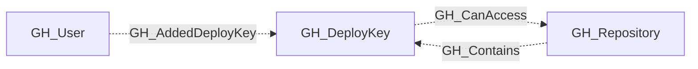
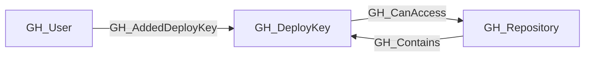

## General Information

A repository-scoped SSH deploy key that grants read-only or read-write access to repository contents.

## Properties

| Property | Type | Description |
| --- | --- | --- |
| `name` | `string` | The node name used for matching and display. |
| `displayname` | `string` | The human-readable display name. |
| `environmentid` | `string` | The identifier of the GitHub environment where this node was collected. |
| `last_seen` | `datetime` | The timestamp when this node was last observed during collection. |
| `node_id` | `string` | The stable identifier used as the OpenGraph node ID; this is the native GitHub node ID where available. |
| `github_id` | `integer` | The numeric GitHub deploy key ID. |
| `title` | `string` | The user-assigned deploy key title. |
| `key` | `string` | The public SSH key material. |
| `verified` | `boolean` | Whether GitHub has verified the deploy key. |
| `enabled` | `boolean` | Whether the deploy key is currently enabled. |
| `read_only` | `boolean` | Whether the deploy key is restricted to read-only repository access. |
| `repository_permissions` | `list[string]` | Repository-scoped permissions in `scope:access` form. |
| `created_at` | `string` | When the deploy key was created. |
| `last_used` | `string` | When the deploy key was last used. |
| `added_by_login` | `string` | The login of the user who added the deploy key. |
| `added_by_id` | `string` | The node ID of the user who added the deploy key. |
| `repository_name` | `string` | The full name of the containing repository. |
| `repository_id` | `string` | The node_id of the containing repository. |
| `environment_name` | `string` | The name of the environment (GitHub organization). |
| `query_repository` | `string` | Query for the containing repository. |
| `query_added_by` | `string` | Query for the user who added the deploy key. |

## Diagram

## Edges

<Note>
The tables below list edges defined by the GitHub extension only. Additional edges to or from this node may be created by other extensions.
</Note>

### Inbound Edges

| Edge Type | Source Node Types | Traversable |
| --------- | ----------------- | ----------- |
| [GH_AddedDeployKey](https://github.com/SpecterOps/bloodhound-docs/blob/main//opengraph/extensions/github/edges/gh_addeddeploykey) | [GH_User](https://github.com/SpecterOps/bloodhound-docs/blob/main//opengraph/extensions/github/nodes/gh_user) | ❌ |
| [GH_Contains](https://github.com/SpecterOps/bloodhound-docs/blob/main//opengraph/extensions/github/edges/gh_contains) | [GH_Repository](https://github.com/SpecterOps/bloodhound-docs/blob/main//opengraph/extensions/github/nodes/gh_repository) | ❌ |

### Outbound Edges

| Edge Type | Destination Node Types | Traversable |
| --------- | ---------------------- | ----------- |
| [GH_CanAccess](https://github.com/SpecterOps/bloodhound-docs/blob/main//opengraph/extensions/github/edges/gh_canaccess) | [GH_Repository](https://github.com/SpecterOps/bloodhound-docs/blob/main//opengraph/extensions/github/nodes/gh_repository) | ❌ |

## Properties

| Property | Type | Description |
| -------- | ---- | ----------- |
| `name` | `str` | - |
| `displayname` | `str` | - |
| `environmentid` | `str` | - |
| `last_seen` | `datetime` | - |
| `node_id` | `str` | - |
| `github_id` | `int \| None` | The numeric GitHub deploy key ID. |
| `title` | `str \| None` | The user-assigned deploy key title. |
| `key` | `str \| None` | The public SSH key material. |
| `verified` | `bool \| None` | Whether GitHub has verified the deploy key. |
| `enabled` | `bool \| None` | Whether the deploy key is currently enabled. |
| `read_only` | `bool \| None` | Whether the deploy key is restricted to read-only repository access. |
| `repository_permissions` | `list[str] \| None` | Repository-scoped permissions in `scope:access` form. |
| `created_at` | `str \| None` | When the deploy key was created. |
| `last_used` | `str \| None` | When the deploy key was last used. |
| `added_by_login` | `str \| None` | The login of the user who added the deploy key. |
| `added_by_id` | `str \| None` | The node ID of the user who added the deploy key. |
| `repository_name` | `str \| None` | The full name of the containing repository. |
| `repository_id` | `str \| None` | The node_id of the containing repository. |
| `environment_name` | `str \| None` | The name of the environment (GitHub organization). |
| `query_repository` | `str \| None` | Query for the containing repository. |
| `query_added_by` | `str \| None` | Query for the user who added the deploy key. |
