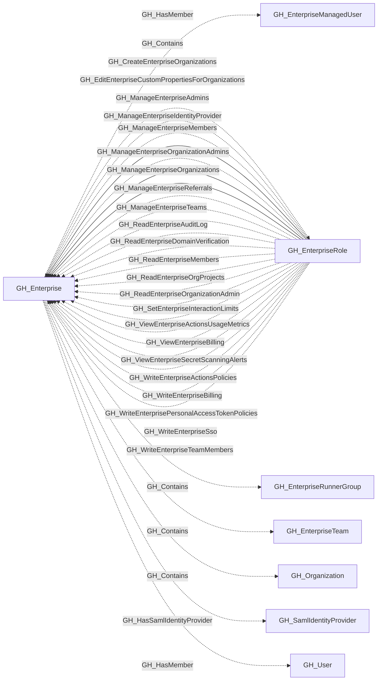
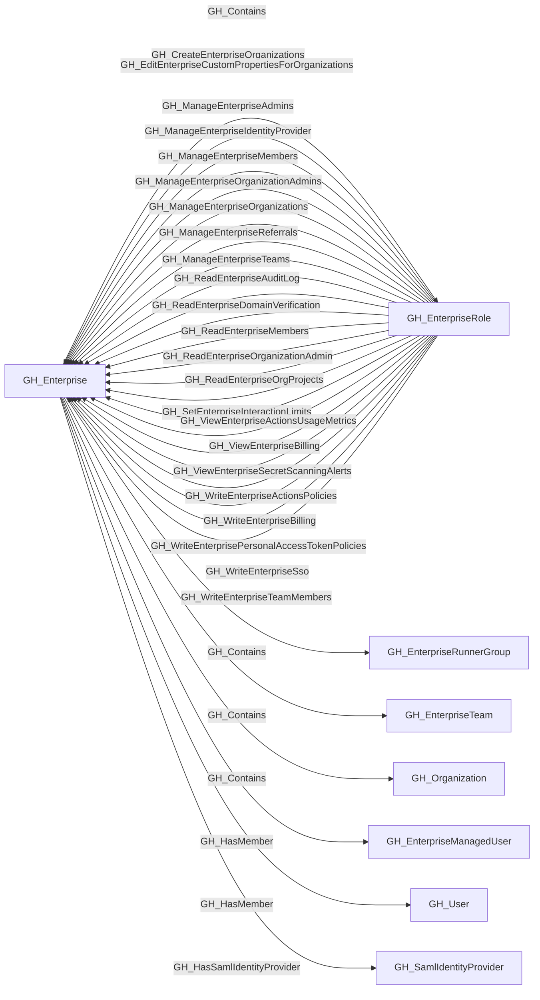

## General Information

A GitHub Enterprise account that contains organizations, enterprise teams, roles, and managed users.

## Properties

| Property | Type | Description |
| --- | --- | --- |
| `name` | `string` | The node name used for matching and display. |
| `displayname` | `string` | The human-readable display name. |
| `environmentid` | `string` | The identifier of the GitHub environment where this node was collected. |
| `last_seen` | `datetime` | The timestamp when this node was last observed during collection. |
| `node_id` | `string` | The stable identifier used as the OpenGraph node ID; this is the native GitHub node ID where available. |
| `collected` | `boolean` | Whether this node was collected directly. |
| `slug` | `string` | The enterprise slug. |
| `enterprise_name` | `string` | The enterprise display name. |
| `description` | `string` | The enterprise description. |
| `location` | `string` | The enterprise location. |
| `url` | `string` | The enterprise GitHub URL. |
| `website_url` | `string` | The enterprise website URL. |
| `created_at` | `string` | When the enterprise was created. |
| `updated_at` | `string` | When the enterprise was last updated. |
| `billing_email` | `string` | The enterprise billing email. |
| `security_contact_email` | `string` | The enterprise security contact email. |
| `viewer_is_admin` | `boolean` | Whether the authenticated viewer is an enterprise admin. |
| `environment_name` | `string` | The enterprise environment name. |
| `query_organizations` | `string` | Query for contained organizations. |

## Diagram

## Edges

<Note>
The tables below list edges defined by the GitHub extension only. Additional edges to or from this node may be created by other extensions.
</Note>

### Inbound Edges

| Edge Type | Source Node Types | Traversable |
| --------- | ----------------- | ----------- |
| [GH_CreateEnterpriseOrganizations](https://github.com/SpecterOps/bloodhound-docs/blob/main//opengraph/extensions/github/edges/gh_createenterpriseorganizations) | [GH_EnterpriseRole](https://github.com/SpecterOps/bloodhound-docs/blob/main//opengraph/extensions/github/nodes/gh_enterpriserole) | ❌ |
| [GH_EditEnterpriseCustomPropertiesForOrganizations](https://github.com/SpecterOps/bloodhound-docs/blob/main//opengraph/extensions/github/edges/gh_editenterprisecustompropertiesfororganizations) | [GH_EnterpriseRole](https://github.com/SpecterOps/bloodhound-docs/blob/main//opengraph/extensions/github/nodes/gh_enterpriserole) | ❌ |
| [GH_ManageEnterpriseAdmins](https://github.com/SpecterOps/bloodhound-docs/blob/main//opengraph/extensions/github/edges/gh_manageenterpriseadmins) | [GH_EnterpriseRole](https://github.com/SpecterOps/bloodhound-docs/blob/main//opengraph/extensions/github/nodes/gh_enterpriserole) | ✅ |
| [GH_ManageEnterpriseIdentityProvider](https://github.com/SpecterOps/bloodhound-docs/blob/main//opengraph/extensions/github/edges/gh_manageenterpriseidentityprovider) | [GH_EnterpriseRole](https://github.com/SpecterOps/bloodhound-docs/blob/main//opengraph/extensions/github/nodes/gh_enterpriserole) | ❌ |
| [GH_ManageEnterpriseMembers](https://github.com/SpecterOps/bloodhound-docs/blob/main//opengraph/extensions/github/edges/gh_manageenterprisemembers) | [GH_EnterpriseRole](https://github.com/SpecterOps/bloodhound-docs/blob/main//opengraph/extensions/github/nodes/gh_enterpriserole) | ✅ |
| [GH_ManageEnterpriseOrganizationAdmins](https://github.com/SpecterOps/bloodhound-docs/blob/main//opengraph/extensions/github/edges/gh_manageenterpriseorganizationadmins) | [GH_EnterpriseRole](https://github.com/SpecterOps/bloodhound-docs/blob/main//opengraph/extensions/github/nodes/gh_enterpriserole) | ✅ |
| [GH_ManageEnterpriseOrganizations](https://github.com/SpecterOps/bloodhound-docs/blob/main//opengraph/extensions/github/edges/gh_manageenterpriseorganizations) | [GH_EnterpriseRole](https://github.com/SpecterOps/bloodhound-docs/blob/main//opengraph/extensions/github/nodes/gh_enterpriserole) | ❌ |
| [GH_ManageEnterpriseReferrals](https://github.com/SpecterOps/bloodhound-docs/blob/main//opengraph/extensions/github/edges/gh_manageenterprisereferrals) | [GH_EnterpriseRole](https://github.com/SpecterOps/bloodhound-docs/blob/main//opengraph/extensions/github/nodes/gh_enterpriserole) | ❌ |
| [GH_ManageEnterpriseTeams](https://github.com/SpecterOps/bloodhound-docs/blob/main//opengraph/extensions/github/edges/gh_manageenterpriseteams) | [GH_EnterpriseRole](https://github.com/SpecterOps/bloodhound-docs/blob/main//opengraph/extensions/github/nodes/gh_enterpriserole) | ❌ |
| [GH_ReadEnterpriseAuditLog](https://github.com/SpecterOps/bloodhound-docs/blob/main//opengraph/extensions/github/edges/gh_readenterpriseauditlog) | [GH_EnterpriseRole](https://github.com/SpecterOps/bloodhound-docs/blob/main//opengraph/extensions/github/nodes/gh_enterpriserole) | ❌ |
| [GH_ReadEnterpriseDomainVerification](https://github.com/SpecterOps/bloodhound-docs/blob/main//opengraph/extensions/github/edges/gh_readenterprisedomainverification) | [GH_EnterpriseRole](https://github.com/SpecterOps/bloodhound-docs/blob/main//opengraph/extensions/github/nodes/gh_enterpriserole) | ❌ |
| [GH_ReadEnterpriseMembers](https://github.com/SpecterOps/bloodhound-docs/blob/main//opengraph/extensions/github/edges/gh_readenterprisemembers) | [GH_EnterpriseRole](https://github.com/SpecterOps/bloodhound-docs/blob/main//opengraph/extensions/github/nodes/gh_enterpriserole) | ❌ |
| [GH_ReadEnterpriseOrganizationAdmin](https://github.com/SpecterOps/bloodhound-docs/blob/main//opengraph/extensions/github/edges/gh_readenterpriseorganizationadmin) | [GH_EnterpriseRole](https://github.com/SpecterOps/bloodhound-docs/blob/main//opengraph/extensions/github/nodes/gh_enterpriserole) | ❌ |
| [GH_ReadEnterpriseOrgProjects](https://github.com/SpecterOps/bloodhound-docs/blob/main//opengraph/extensions/github/edges/gh_readenterpriseorgprojects) | [GH_EnterpriseRole](https://github.com/SpecterOps/bloodhound-docs/blob/main//opengraph/extensions/github/nodes/gh_enterpriserole) | ❌ |
| [GH_SetEnterpriseInteractionLimits](https://github.com/SpecterOps/bloodhound-docs/blob/main//opengraph/extensions/github/edges/gh_setenterpriseinteractionlimits) | [GH_EnterpriseRole](https://github.com/SpecterOps/bloodhound-docs/blob/main//opengraph/extensions/github/nodes/gh_enterpriserole) | ❌ |
| [GH_ViewEnterpriseActionsUsageMetrics](https://github.com/SpecterOps/bloodhound-docs/blob/main//opengraph/extensions/github/edges/gh_viewenterpriseactionsusagemetrics) | [GH_EnterpriseRole](https://github.com/SpecterOps/bloodhound-docs/blob/main//opengraph/extensions/github/nodes/gh_enterpriserole) | ❌ |
| [GH_ViewEnterpriseBilling](https://github.com/SpecterOps/bloodhound-docs/blob/main//opengraph/extensions/github/edges/gh_viewenterprisebilling) | [GH_EnterpriseRole](https://github.com/SpecterOps/bloodhound-docs/blob/main//opengraph/extensions/github/nodes/gh_enterpriserole) | ❌ |
| [GH_ViewEnterpriseSecretScanningAlerts](https://github.com/SpecterOps/bloodhound-docs/blob/main//opengraph/extensions/github/edges/gh_viewenterprisesecretscanningalerts) | [GH_EnterpriseRole](https://github.com/SpecterOps/bloodhound-docs/blob/main//opengraph/extensions/github/nodes/gh_enterpriserole) | ❌ |
| [GH_WriteEnterpriseActionsPolicies](https://github.com/SpecterOps/bloodhound-docs/blob/main//opengraph/extensions/github/edges/gh_writeenterpriseactionspolicies) | [GH_EnterpriseRole](https://github.com/SpecterOps/bloodhound-docs/blob/main//opengraph/extensions/github/nodes/gh_enterpriserole) | ❌ |
| [GH_WriteEnterpriseBilling](https://github.com/SpecterOps/bloodhound-docs/blob/main//opengraph/extensions/github/edges/gh_writeenterprisebilling) | [GH_EnterpriseRole](https://github.com/SpecterOps/bloodhound-docs/blob/main//opengraph/extensions/github/nodes/gh_enterpriserole) | ❌ |
| [GH_WriteEnterprisePersonalAccessTokenPolicies](https://github.com/SpecterOps/bloodhound-docs/blob/main//opengraph/extensions/github/edges/gh_writeenterprisepersonalaccesstokenpolicies) | [GH_EnterpriseRole](https://github.com/SpecterOps/bloodhound-docs/blob/main//opengraph/extensions/github/nodes/gh_enterpriserole) | ❌ |
| [GH_WriteEnterpriseSso](https://github.com/SpecterOps/bloodhound-docs/blob/main//opengraph/extensions/github/edges/gh_writeenterprisesso) | [GH_EnterpriseRole](https://github.com/SpecterOps/bloodhound-docs/blob/main//opengraph/extensions/github/nodes/gh_enterpriserole) | ❌ |
| [GH_WriteEnterpriseTeamMembers](https://github.com/SpecterOps/bloodhound-docs/blob/main//opengraph/extensions/github/edges/gh_writeenterpriseteammembers) | [GH_EnterpriseRole](https://github.com/SpecterOps/bloodhound-docs/blob/main//opengraph/extensions/github/nodes/gh_enterpriserole) | ❌ |

### Outbound Edges

| Edge Type | Destination Node Types | Traversable |
| --------- | ---------------------- | ----------- |
| [GH_Contains](https://github.com/SpecterOps/bloodhound-docs/blob/main//opengraph/extensions/github/edges/gh_contains) | [GH_EnterpriseRole](https://github.com/SpecterOps/bloodhound-docs/blob/main//opengraph/extensions/github/nodes/gh_enterpriserole), [GH_EnterpriseRunnerGroup](https://github.com/SpecterOps/bloodhound-docs/blob/main//opengraph/extensions/github/nodes/gh_enterpriserunnergroup), [GH_EnterpriseTeam](https://github.com/SpecterOps/bloodhound-docs/blob/main//opengraph/extensions/github/nodes/gh_enterpriseteam), [GH_Organization](https://github.com/SpecterOps/bloodhound-docs/blob/main//opengraph/extensions/github/nodes/gh_organization) | ❌ |
| [GH_HasMember](https://github.com/SpecterOps/bloodhound-docs/blob/main//opengraph/extensions/github/edges/gh_hasmember) | [GH_EnterpriseManagedUser](https://github.com/SpecterOps/bloodhound-docs/blob/main//opengraph/extensions/github/nodes/gh_enterprisemanageduser), [GH_User](https://github.com/SpecterOps/bloodhound-docs/blob/main//opengraph/extensions/github/nodes/gh_user) | ❌ |
| [GH_HasSamlIdentityProvider](https://github.com/SpecterOps/bloodhound-docs/blob/main//opengraph/extensions/github/edges/gh_hassamlidentityprovider) | [GH_SamlIdentityProvider](https://github.com/SpecterOps/bloodhound-docs/blob/main//opengraph/extensions/github/nodes/gh_samlidentityprovider) | ❌ |

## Properties

| Property | Type | Description |
| -------- | ---- | ----------- |
| `name` | `str` | - |
| `displayname` | `str` | - |
| `environmentid` | `str` | - |
| `last_seen` | `datetime` | - |
| `node_id` | `str` | - |
| `collected` | `bool` | Whether this node was collected directly. |
| `slug` | `str \| None` | The enterprise slug. |
| `enterprise_name` | `str \| None` | The enterprise display name. |
| `description` | `str \| None` | The enterprise description. |
| `location` | `str \| None` | The enterprise location. |
| `url` | `str \| None` | The enterprise GitHub URL. |
| `website_url` | `str \| None` | The enterprise website URL. |
| `created_at` | `str \| None` | When the enterprise was created. |
| `updated_at` | `str \| None` | When the enterprise was last updated. |
| `billing_email` | `str \| None` | The enterprise billing email. |
| `security_contact_email` | `str \| None` | The enterprise security contact email. |
| `viewer_is_admin` | `bool \| None` | Whether the authenticated viewer is an enterprise admin. |
| `environment_name` | `str \| None` | The enterprise environment name. |
| `query_organizations` | `str \| None` | Query for contained organizations. |
