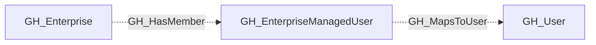

## General Information

A GitHub Enterprise managed user account linked to an enterprise identity provider.

## Properties

| Property | Type | Description |
| --- | --- | --- |
| `name` | `string` | The node name used for matching and display. |
| `displayname` | `string` | The human-readable display name. |
| `environmentid` | `string` | The identifier of the GitHub environment where this node was collected. |
| `last_seen` | `datetime` | The timestamp when this node was last observed during collection. |
| `node_id` | `string` | The stable identifier used as the OpenGraph node ID; this is the native GitHub node ID where available. |
| `login` | `string` | The managed user login. |
| `full_name` | `string` | The managed user display name. |
| `url` | `string` | The managed user URL. |
| `created_at` | `string` | When the managed user was created. |
| `updated_at` | `string` | When the managed user was last updated. |
| `github_user_id` | `string` | The backing GitHub user ID. |
| `github_username` | `string` | The backing GitHub username. |
| `environment_name` | `string` | The enterprise environment name. |
| `query_enterprises` | `string` | Query for enterprises containing this managed user. |
| `query_mapped_user` | `string` | Query for the backing GitHub user. |

## Diagram

## Edges

<Note>
The tables below list edges defined by the GitHub extension only. Additional edges to or from this node may be created by other extensions.
</Note>

### Inbound Edges

| Edge Type | Source Node Types | Traversable |
| --------- | ----------------- | ----------- |
| [GH_HasMember](https://github.com/SpecterOps/bloodhound-docs/blob/main//opengraph/extensions/github/edges/gh_hasmember) | [GH_Enterprise](https://github.com/SpecterOps/bloodhound-docs/blob/main//opengraph/extensions/github/nodes/gh_enterprise) | ❌ |

### Outbound Edges

| Edge Type | Destination Node Types | Traversable |
| --------- | ---------------------- | ----------- |
| [GH_MapsToUser](https://github.com/SpecterOps/bloodhound-docs/blob/main//opengraph/extensions/github/edges/gh_mapstouser) | [GH_User](https://github.com/SpecterOps/bloodhound-docs/blob/main//opengraph/extensions/github/nodes/gh_user) | ❌ |

## Properties

| Property | Type | Description |
| -------- | ---- | ----------- |
| `name` | `str` | - |
| `displayname` | `str` | - |
| `environmentid` | `str` | - |
| `last_seen` | `datetime` | - |
| `node_id` | `str` | - |
| `login` | `str \| None` | The managed user login. |
| `full_name` | `str \| None` | The managed user display name. |
| `url` | `str \| None` | The managed user URL. |
| `created_at` | `str \| None` | When the managed user was created. |
| `updated_at` | `str \| None` | When the managed user was last updated. |
| `github_user_id` | `str \| None` | The backing GitHub user ID. |
| `github_username` | `str \| None` | The backing GitHub username. |
| `environment_name` | `str \| None` | The enterprise environment name. |
| `query_enterprises` | `str \| None` | Query for enterprises containing this managed user. |
| `query_mapped_user` | `str \| None` | Query for the backing GitHub user. |
