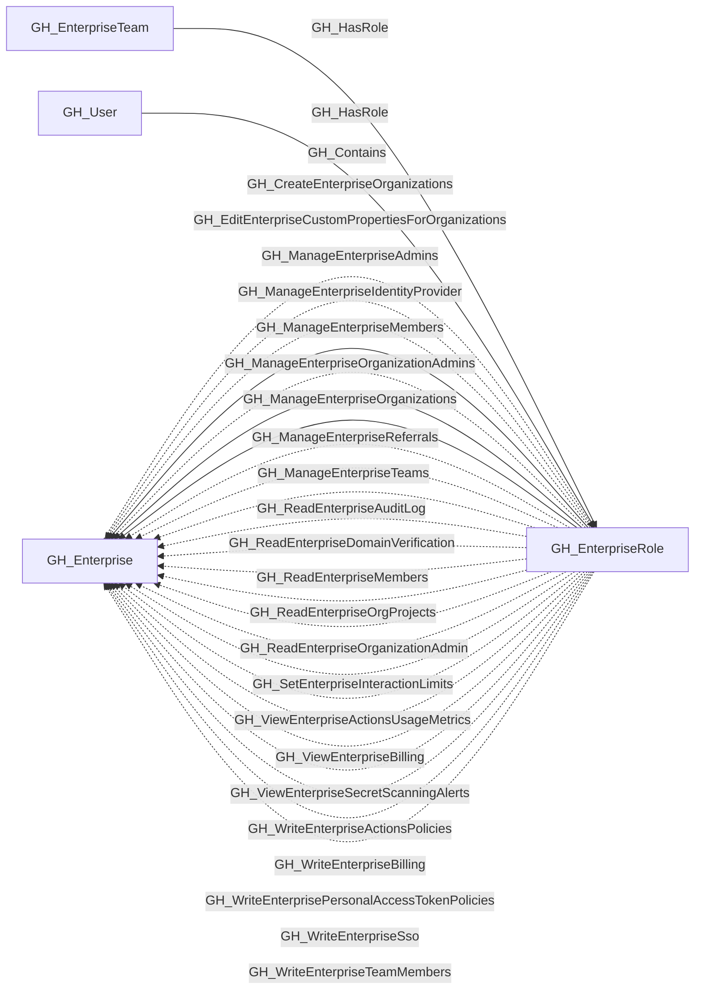
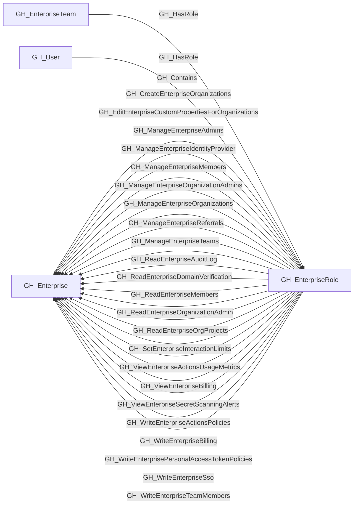

## General Information

The role a user or team has at the GitHub Enterprise level.

## Properties

| Property | Type | Description |
| --- | --- | --- |
| `name` | `string` | The node name used for matching and display. |
| `displayname` | `string` | The human-readable display name. |
| `environmentid` | `string` | The identifier of the GitHub environment where this node was collected. |
| `last_seen` | `datetime` | The timestamp when this node was last observed during collection. |
| `node_id` | `string` | The stable identifier used as the OpenGraph node ID; this is the native GitHub node ID where available. |
| `github_role_id` | `string or integer` | The raw GitHub role ID. |
| `short_name` | `string` | The role short name. |
| `description` | `string` | The role description. |
| `source` | `string` | The role source. |
| `type` | `string` | The role type. |
| `created_at` | `string` | When the role was created. |
| `updated_at` | `string` | When the role was last updated. |
| `permissions` | `list[string]` | Raw enterprise permission strings. |
| `environment_name` | `string` | The enterprise environment name. |
| `query_enterprise` | `string` | Query for the containing enterprise. |
| `query_explicit_members` | `string` | Query for direct user members. |
| `query_team_members` | `string` | Query for team-assigned members. |

## Diagram

## Edges

<Note>
The tables below list edges defined by the GitHub extension only. Additional edges to or from this node may be created by other extensions.
</Note>

### Inbound Edges

| Edge Type | Source Node Types | Traversable |
| --------- | ----------------- | ----------- |
| [GH_Contains](https://github.com/SpecterOps/bloodhound-docs/blob/main//opengraph/extensions/github/edges/gh_contains) | [GH_Enterprise](https://github.com/SpecterOps/bloodhound-docs/blob/main//opengraph/extensions/github/nodes/gh_enterprise) | ❌ |
| [GH_HasRole](https://github.com/SpecterOps/bloodhound-docs/blob/main//opengraph/extensions/github/edges/gh_hasrole) | [GH_EnterpriseTeam](https://github.com/SpecterOps/bloodhound-docs/blob/main//opengraph/extensions/github/nodes/gh_enterpriseteam), [GH_User](https://github.com/SpecterOps/bloodhound-docs/blob/main//opengraph/extensions/github/nodes/gh_user) | ✅ |

### Outbound Edges

| Edge Type | Destination Node Types | Traversable |
| --------- | ---------------------- | ----------- |
| [GH_CreateEnterpriseOrganizations](https://github.com/SpecterOps/bloodhound-docs/blob/main//opengraph/extensions/github/edges/gh_createenterpriseorganizations) | [GH_Enterprise](https://github.com/SpecterOps/bloodhound-docs/blob/main//opengraph/extensions/github/nodes/gh_enterprise) | ❌ |
| [GH_EditEnterpriseCustomPropertiesForOrganizations](https://github.com/SpecterOps/bloodhound-docs/blob/main//opengraph/extensions/github/edges/gh_editenterprisecustompropertiesfororganizations) | [GH_Enterprise](https://github.com/SpecterOps/bloodhound-docs/blob/main//opengraph/extensions/github/nodes/gh_enterprise) | ❌ |
| [GH_ManageEnterpriseAdmins](https://github.com/SpecterOps/bloodhound-docs/blob/main//opengraph/extensions/github/edges/gh_manageenterpriseadmins) | [GH_Enterprise](https://github.com/SpecterOps/bloodhound-docs/blob/main//opengraph/extensions/github/nodes/gh_enterprise) | ✅ |
| [GH_ManageEnterpriseIdentityProvider](https://github.com/SpecterOps/bloodhound-docs/blob/main//opengraph/extensions/github/edges/gh_manageenterpriseidentityprovider) | [GH_Enterprise](https://github.com/SpecterOps/bloodhound-docs/blob/main//opengraph/extensions/github/nodes/gh_enterprise) | ❌ |
| [GH_ManageEnterpriseMembers](https://github.com/SpecterOps/bloodhound-docs/blob/main//opengraph/extensions/github/edges/gh_manageenterprisemembers) | [GH_Enterprise](https://github.com/SpecterOps/bloodhound-docs/blob/main//opengraph/extensions/github/nodes/gh_enterprise) | ✅ |
| [GH_ManageEnterpriseOrganizationAdmins](https://github.com/SpecterOps/bloodhound-docs/blob/main//opengraph/extensions/github/edges/gh_manageenterpriseorganizationadmins) | [GH_Enterprise](https://github.com/SpecterOps/bloodhound-docs/blob/main//opengraph/extensions/github/nodes/gh_enterprise) | ✅ |
| [GH_ManageEnterpriseOrganizations](https://github.com/SpecterOps/bloodhound-docs/blob/main//opengraph/extensions/github/edges/gh_manageenterpriseorganizations) | [GH_Enterprise](https://github.com/SpecterOps/bloodhound-docs/blob/main//opengraph/extensions/github/nodes/gh_enterprise) | ❌ |
| [GH_ManageEnterpriseReferrals](https://github.com/SpecterOps/bloodhound-docs/blob/main//opengraph/extensions/github/edges/gh_manageenterprisereferrals) | [GH_Enterprise](https://github.com/SpecterOps/bloodhound-docs/blob/main//opengraph/extensions/github/nodes/gh_enterprise) | ❌ |
| [GH_ManageEnterpriseTeams](https://github.com/SpecterOps/bloodhound-docs/blob/main//opengraph/extensions/github/edges/gh_manageenterpriseteams) | [GH_Enterprise](https://github.com/SpecterOps/bloodhound-docs/blob/main//opengraph/extensions/github/nodes/gh_enterprise) | ❌ |
| [GH_ReadEnterpriseAuditLog](https://github.com/SpecterOps/bloodhound-docs/blob/main//opengraph/extensions/github/edges/gh_readenterpriseauditlog) | [GH_Enterprise](https://github.com/SpecterOps/bloodhound-docs/blob/main//opengraph/extensions/github/nodes/gh_enterprise) | ❌ |
| [GH_ReadEnterpriseDomainVerification](https://github.com/SpecterOps/bloodhound-docs/blob/main//opengraph/extensions/github/edges/gh_readenterprisedomainverification) | [GH_Enterprise](https://github.com/SpecterOps/bloodhound-docs/blob/main//opengraph/extensions/github/nodes/gh_enterprise) | ❌ |
| [GH_ReadEnterpriseMembers](https://github.com/SpecterOps/bloodhound-docs/blob/main//opengraph/extensions/github/edges/gh_readenterprisemembers) | [GH_Enterprise](https://github.com/SpecterOps/bloodhound-docs/blob/main//opengraph/extensions/github/nodes/gh_enterprise) | ❌ |
| [GH_ReadEnterpriseOrganizationAdmin](https://github.com/SpecterOps/bloodhound-docs/blob/main//opengraph/extensions/github/edges/gh_readenterpriseorganizationadmin) | [GH_Enterprise](https://github.com/SpecterOps/bloodhound-docs/blob/main//opengraph/extensions/github/nodes/gh_enterprise) | ❌ |
| [GH_ReadEnterpriseOrgProjects](https://github.com/SpecterOps/bloodhound-docs/blob/main//opengraph/extensions/github/edges/gh_readenterpriseorgprojects) | [GH_Enterprise](https://github.com/SpecterOps/bloodhound-docs/blob/main//opengraph/extensions/github/nodes/gh_enterprise) | ❌ |
| [GH_SetEnterpriseInteractionLimits](https://github.com/SpecterOps/bloodhound-docs/blob/main//opengraph/extensions/github/edges/gh_setenterpriseinteractionlimits) | [GH_Enterprise](https://github.com/SpecterOps/bloodhound-docs/blob/main//opengraph/extensions/github/nodes/gh_enterprise) | ❌ |
| [GH_ViewEnterpriseActionsUsageMetrics](https://github.com/SpecterOps/bloodhound-docs/blob/main//opengraph/extensions/github/edges/gh_viewenterpriseactionsusagemetrics) | [GH_Enterprise](https://github.com/SpecterOps/bloodhound-docs/blob/main//opengraph/extensions/github/nodes/gh_enterprise) | ❌ |
| [GH_ViewEnterpriseBilling](https://github.com/SpecterOps/bloodhound-docs/blob/main//opengraph/extensions/github/edges/gh_viewenterprisebilling) | [GH_Enterprise](https://github.com/SpecterOps/bloodhound-docs/blob/main//opengraph/extensions/github/nodes/gh_enterprise) | ❌ |
| [GH_ViewEnterpriseSecretScanningAlerts](https://github.com/SpecterOps/bloodhound-docs/blob/main//opengraph/extensions/github/edges/gh_viewenterprisesecretscanningalerts) | [GH_Enterprise](https://github.com/SpecterOps/bloodhound-docs/blob/main//opengraph/extensions/github/nodes/gh_enterprise) | ❌ |
| [GH_WriteEnterpriseActionsPolicies](https://github.com/SpecterOps/bloodhound-docs/blob/main//opengraph/extensions/github/edges/gh_writeenterpriseactionspolicies) | [GH_Enterprise](https://github.com/SpecterOps/bloodhound-docs/blob/main//opengraph/extensions/github/nodes/gh_enterprise) | ❌ |
| [GH_WriteEnterpriseBilling](https://github.com/SpecterOps/bloodhound-docs/blob/main//opengraph/extensions/github/edges/gh_writeenterprisebilling) | [GH_Enterprise](https://github.com/SpecterOps/bloodhound-docs/blob/main//opengraph/extensions/github/nodes/gh_enterprise) | ❌ |
| [GH_WriteEnterprisePersonalAccessTokenPolicies](https://github.com/SpecterOps/bloodhound-docs/blob/main//opengraph/extensions/github/edges/gh_writeenterprisepersonalaccesstokenpolicies) | [GH_Enterprise](https://github.com/SpecterOps/bloodhound-docs/blob/main//opengraph/extensions/github/nodes/gh_enterprise) | ❌ |
| [GH_WriteEnterpriseSso](https://github.com/SpecterOps/bloodhound-docs/blob/main//opengraph/extensions/github/edges/gh_writeenterprisesso) | [GH_Enterprise](https://github.com/SpecterOps/bloodhound-docs/blob/main//opengraph/extensions/github/nodes/gh_enterprise) | ❌ |
| [GH_WriteEnterpriseTeamMembers](https://github.com/SpecterOps/bloodhound-docs/blob/main//opengraph/extensions/github/edges/gh_writeenterpriseteammembers) | [GH_Enterprise](https://github.com/SpecterOps/bloodhound-docs/blob/main//opengraph/extensions/github/nodes/gh_enterprise) | ❌ |

## Properties

| Property | Type | Description |
| -------- | ---- | ----------- |
| `name` | `str` | - |
| `displayname` | `str` | - |
| `environmentid` | `str` | - |
| `last_seen` | `datetime` | - |
| `node_id` | `str` | - |
| `github_role_id` | `str \| int \| None` | The raw GitHub role ID. |
| `short_name` | `str \| None` | The role short name. |
| `description` | `str \| None` | The role description. |
| `source` | `str \| None` | The role source. |
| `type` | `str \| None` | The role type. |
| `created_at` | `str \| None` | When the role was created. |
| `updated_at` | `str \| None` | When the role was last updated. |
| `permissions` | `list[str] \| None` | Raw enterprise permission strings. |
| `environment_name` | `str \| None` | The enterprise environment name. |
| `query_enterprise` | `str \| None` | Query for the containing enterprise. |
| `query_explicit_members` | `str \| None` | Query for direct user members. |
| `query_team_members` | `str \| None` | Query for team-assigned members. |
