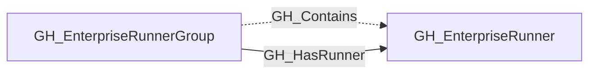
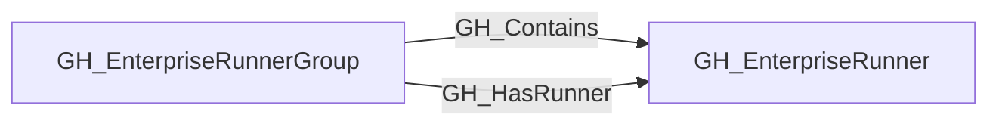

## General Information

Represents a self-hosted runner owned at the GitHub Enterprise level. Enterprise runners are contained by [GH_EnterpriseRunnerGroup](https://github.com/SpecterOps/bloodhound-docs/blob/main//opengraph/extensions/github/nodes/gh_enterpriserunnergroup) nodes and exposed through [GH_HasRunner](https://github.com/SpecterOps/bloodhound-docs/blob/main//opengraph/extensions/github/edges/gh_hasrunner). Repositories become eligible for the organization-facing runner group through [GH_IsEligibleFor](https://github.com/SpecterOps/bloodhound-docs/blob/main//opengraph/extensions/github/edges/gh_iseligiblefor). Repositories and branches that can dispatch workflows then reach the runner through [GH_CanUseRunner](https://github.com/SpecterOps/bloodhound-docs/blob/main//opengraph/extensions/github/edges/gh_canuserunner) to an inherited [GH_OrgRunnerGroup](https://github.com/SpecterOps/bloodhound-docs/blob/main//opengraph/extensions/github/nodes/gh_orgrunnergroup), [GH_InheritedFrom](https://github.com/SpecterOps/bloodhound-docs/blob/main//opengraph/extensions/github/edges/gh_inheritedfrom) to the enterprise group, and finally [GH_HasRunner](https://github.com/SpecterOps/bloodhound-docs/blob/main//opengraph/extensions/github/edges/gh_hasrunner) to the runner.

The node captures runner metadata such as operating system, status, busy state, labels, and whether the runner is ephemeral when GitHub returns that property.

## Properties

| Property | Type | Description |
| --- | --- | --- |
| `name` | `string` | The node name used for matching and display. |
| `displayname` | `string` | The human-readable display name. |
| `environmentid` | `string` | The identifier of the GitHub environment where this node was collected. |
| `last_seen` | `datetime` | The timestamp when this node was last observed during collection. |
| `node_id` | `string` | The stable identifier used as the OpenGraph node ID; this is the native GitHub node ID where available. |
| `scope` | `string` | Whether the runner is enterprise, organization, or repository scoped. |
| `runner_id` | `integer` | The GitHub runner ID. |
| `os` | `string` | The runner operating system. |
| `status` | `string` | The runner status. |
| `busy` | `boolean` | Whether the runner is currently busy. |
| `ephemeral` | `boolean` | Whether the runner is ephemeral. |
| `labels` | `string` | JSON array of runner labels. |
| `runner_group_id` | `integer` | The associated runner group ID. |
| `runner_group_name` | `string` | The associated runner group name. |
| `runner_group_visibility` | `string` | Runner group visibility when organization scoped. |
| `repository_name` | `string` | The repository name for repository-scoped runners. |
| `repository_id` | `string` | The repository node_id for repository-scoped runners. |
| `repository_full_name` | `string` | The full repository name for repository-scoped runners. |
| `environment_name` | `string` | The name of the environment (GitHub organization). |
| `query_group` | `string` | Query for group. |
| `query_repositories` | `string` | Query for repositories. |

## Diagram

## Edges

<Note>
The tables below list edges defined by the GitHub extension only. Additional edges to or from this node may be created by other extensions.
</Note>

### Inbound Edges

| Edge Type | Source Node Types | Traversable |
| --------- | ----------------- | ----------- |
| [GH_Contains](https://github.com/SpecterOps/bloodhound-docs/blob/main//opengraph/extensions/github/edges/gh_contains) | [GH_EnterpriseRunnerGroup](https://github.com/SpecterOps/bloodhound-docs/blob/main//opengraph/extensions/github/nodes/gh_enterpriserunnergroup) | ❌ |
| [GH_HasRunner](https://github.com/SpecterOps/bloodhound-docs/blob/main//opengraph/extensions/github/edges/gh_hasrunner) | [GH_EnterpriseRunnerGroup](https://github.com/SpecterOps/bloodhound-docs/blob/main//opengraph/extensions/github/nodes/gh_enterpriserunnergroup) | ✅ |

### Outbound Edges

No outbound edges are defined by the GitHub extension for this node.

## Properties

| Property | Type | Description |
| -------- | ---- | ----------- |
| `name` | `str` | - |
| `displayname` | `str` | - |
| `environmentid` | `str` | - |
| `last_seen` | `datetime` | - |
| `node_id` | `str` | - |
| `scope` | `str \| None` | Whether the runner is enterprise, organization, or repository scoped. |
| `runner_id` | `int \| None` | The GitHub runner ID. |
| `os` | `str \| None` | The runner operating system. |
| `status` | `str \| None` | The runner status. |
| `busy` | `bool \| None` | Whether the runner is currently busy. |
| `ephemeral` | `bool \| None` | Whether the runner is ephemeral. |
| `labels` | `str \| None` | JSON array of runner labels. |
| `runner_group_id` | `int \| None` | The associated runner group ID. |
| `runner_group_name` | `str \| None` | The associated runner group name. |
| `runner_group_visibility` | `str \| None` | Runner group visibility when organization scoped. |
| `repository_name` | `str \| None` | The repository name for repository-scoped runners. |
| `repository_id` | `str \| None` | The repository node_id for repository-scoped runners. |
| `repository_full_name` | `str \| None` | The full repository name for repository-scoped runners. |
| `environment_name` | `str \| None` | The name of the environment (GitHub organization). |
| `query_group` | `str \| None` | Query for group. |
| `query_repositories` | `str \| None` | Query for repositories. |
