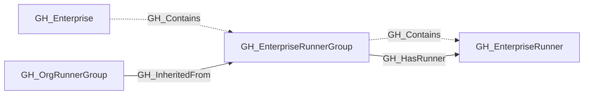
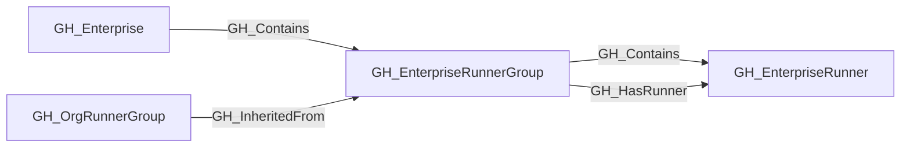

## General Information

Represents a self-hosted runner group owned by a GitHub Enterprise account. Enterprise runner groups control which organizations may use a shared set of enterprise runners. That organization-level visibility is reflected by which inherited [GH_OrgRunnerGroup](https://github.com/SpecterOps/bloodhound-docs/blob/main//opengraph/extensions/github/nodes/gh_orgrunnergroup) nodes point back to the enterprise group through [GH_InheritedFrom](https://github.com/SpecterOps/bloodhound-docs/blob/main//opengraph/extensions/github/edges/gh_inheritedfrom).

Enterprise runner groups contain [GH_EnterpriseRunner](https://github.com/SpecterOps/bloodhound-docs/blob/main//opengraph/extensions/github/nodes/gh_enterpriserunner) nodes and emit [GH_HasRunner](https://github.com/SpecterOps/bloodhound-docs/blob/main//opengraph/extensions/github/edges/gh_hasrunner) for directly assigned runners to represent the traversable capability hop from the group to the runner. They may be projected into organizations as inherited [GH_OrgRunnerGroup](https://github.com/SpecterOps/bloodhound-docs/blob/main//opengraph/extensions/github/nodes/gh_orgrunnergroup) nodes. The [GH_InheritedFrom](https://github.com/SpecterOps/bloodhound-docs/blob/main//opengraph/extensions/github/edges/gh_inheritedfrom) edge links the organization view back to the enterprise-owned group.

## Properties

| Property | Type | Description |
| --- | --- | --- |
| `name` | `string` | The node name used for matching and display. |
| `displayname` | `string` | The human-readable display name. |
| `environmentid` | `string` | The identifier of the GitHub environment where this node was collected. |
| `last_seen` | `datetime` | The timestamp when this node was last observed during collection. |
| `node_id` | `string` | The stable identifier used as the OpenGraph node ID; this is the native GitHub node ID where available. |
| `scope` | `string` | Whether the runner group is enterprise or organization scoped. |
| `group_id` | `integer` | The GitHub runner group ID. |
| `group_name` | `string` | The runner group display name. |
| `visibility` | `string` | Which repositories can use this group: `all`, `private`, or `selected`. |
| `default` | `boolean` | Whether this is the default runner group. |
| `inherited` | `boolean` | Whether this runner group is inherited. |
| `allows_public_repositories` | `boolean` | Whether public repositories may use this group. |
| `restricted_to_workflows` | `boolean` | Whether access is restricted to selected workflows. |
| `selected_workflows` | `string` | JSON array of selected workflows, if configured. |
| `runners_url` | `string` | API URL for runners in this group. |
| `selected_organizations_url` | `string` | API URL for organizations assigned to an enterprise group. |
| `environment_name` | `string` | The name of the environment (GitHub organization or enterprise). |
| `query_runners` | `string` | Query for runners. |
| `query_organizations` | `string` | Query for organizations inheriting an enterprise runner group. |
| `query_repositories` | `string` | Query for repositories. |

## Diagram

## Edges

<Note>
The tables below list edges defined by the GitHub extension only. Additional edges to or from this node may be created by other extensions.
</Note>

### Inbound Edges

| Edge Type | Source Node Types | Traversable |
| --------- | ----------------- | ----------- |
| [GH_Contains](https://github.com/SpecterOps/bloodhound-docs/blob/main//opengraph/extensions/github/edges/gh_contains) | [GH_Enterprise](https://github.com/SpecterOps/bloodhound-docs/blob/main//opengraph/extensions/github/nodes/gh_enterprise) | ❌ |
| [GH_InheritedFrom](https://github.com/SpecterOps/bloodhound-docs/blob/main//opengraph/extensions/github/edges/gh_inheritedfrom) | [GH_OrgRunnerGroup](https://github.com/SpecterOps/bloodhound-docs/blob/main//opengraph/extensions/github/nodes/gh_orgrunnergroup) | ✅ |

### Outbound Edges

| Edge Type | Destination Node Types | Traversable |
| --------- | ---------------------- | ----------- |
| [GH_Contains](https://github.com/SpecterOps/bloodhound-docs/blob/main//opengraph/extensions/github/edges/gh_contains) | [GH_EnterpriseRunner](https://github.com/SpecterOps/bloodhound-docs/blob/main//opengraph/extensions/github/nodes/gh_enterpriserunner) | ❌ |
| [GH_HasRunner](https://github.com/SpecterOps/bloodhound-docs/blob/main//opengraph/extensions/github/edges/gh_hasrunner) | [GH_EnterpriseRunner](https://github.com/SpecterOps/bloodhound-docs/blob/main//opengraph/extensions/github/nodes/gh_enterpriserunner) | ✅ |

## Properties

| Property | Type | Description |
| -------- | ---- | ----------- |
| `name` | `str` | - |
| `displayname` | `str` | - |
| `environmentid` | `str` | - |
| `last_seen` | `datetime` | - |
| `node_id` | `str` | - |
| `scope` | `str \| None` | Whether the runner group is enterprise or organization scoped. |
| `group_id` | `int \| None` | The GitHub runner group ID. |
| `group_name` | `str \| None` | The runner group display name. |
| `visibility` | `str \| None` | Which repositories can use this group: `all`, `private`, or `selected`. |
| `default` | `bool \| None` | Whether this is the default runner group. |
| `inherited` | `bool \| None` | Whether this runner group is inherited. |
| `allows_public_repositories` | `bool \| None` | Whether public repositories may use this group. |
| `restricted_to_workflows` | `bool \| None` | Whether access is restricted to selected workflows. |
| `selected_workflows` | `str \| None` | JSON array of selected workflows, if configured. |
| `runners_url` | `str \| None` | API URL for runners in this group. |
| `selected_organizations_url` | `str \| None` | API URL for organizations assigned to an enterprise group. |
| `environment_name` | `str \| None` | The name of the environment (GitHub organization or enterprise). |
| `query_runners` | `str \| None` | Query for runners. |
| `query_organizations` | `str \| None` | Query for organizations inheriting an enterprise runner group. |
| `query_repositories` | `str \| None` | Query for repositories. |
