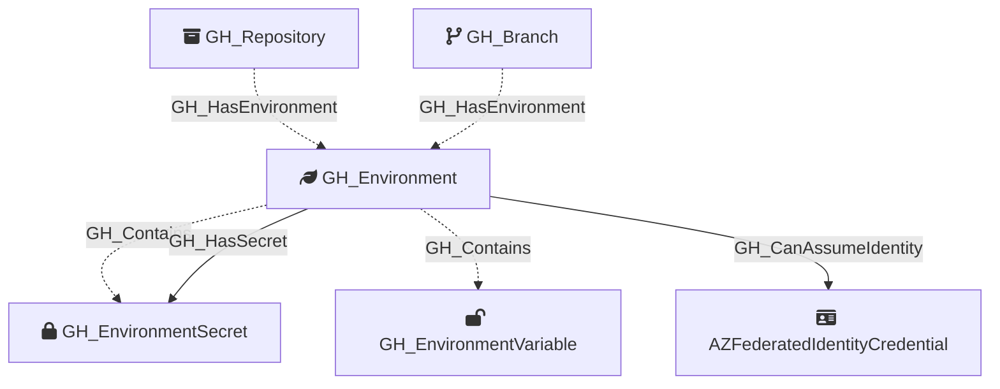

Represents a GitHub Actions deployment environment configured on a repository. Environments can have protection rules including required reviewers, wait timers, and deployment branch policies. When custom branch policies are configured, the environment is connected to specific branches; otherwise, it is connected directly to the repository.

## Edges

<Note>
The tables below list edges defined by the GitHub extension only. Additional edges to or from this node may be created by other extensions.
</Note>

### Inbound Edges

| Edge Type | Source Node Types | Traversable |
| --------- | ----------------- | ----------- |
| [GH_HasEnvironment](https://github.com/SpecterOps/bloodhound-docs/blob/main//opengraph/extensions/github/edges/gh_hasenvironment) | [GH_Repository](https://github.com/SpecterOps/bloodhound-docs/blob/main//opengraph/extensions/github/nodes/gh_repository), [GH_Branch](https://github.com/SpecterOps/bloodhound-docs/blob/main//opengraph/extensions/github/nodes/gh_branch) | ❌ |

### Outbound Edges

| Edge Type | Destination Node Types | Traversable |
| --------- | ---------------------- | ----------- |
| [GH_CanAssumeIdentity](https://github.com/SpecterOps/bloodhound-docs/blob/main//opengraph/extensions/github/edges/gh_canassumeidentity) | [AZFederatedIdentityCredential](https://github.com/SpecterOps/bloodhound-docs/blob/main//resources/nodes/az-federated-identity-credential), `AWSRole` | ✅ |
| [GH_Contains](https://github.com/SpecterOps/bloodhound-docs/blob/main//opengraph/extensions/github/edges/gh_contains) | [GH_User](https://github.com/SpecterOps/bloodhound-docs/blob/main//opengraph/extensions/github/nodes/gh_user), [GH_Team](https://github.com/SpecterOps/bloodhound-docs/blob/main//opengraph/extensions/github/nodes/gh_team), [GH_Repository](https://github.com/SpecterOps/bloodhound-docs/blob/main//opengraph/extensions/github/nodes/gh_repository), [GH_OrgRole](https://github.com/SpecterOps/bloodhound-docs/blob/main//opengraph/extensions/github/nodes/gh_orgrole), [GH_RepoRole](https://github.com/SpecterOps/bloodhound-docs/blob/main//opengraph/extensions/github/nodes/gh_reporole), [GH_TeamRole](https://github.com/SpecterOps/bloodhound-docs/blob/main//opengraph/extensions/github/nodes/gh_teamrole), [GH_OrgSecret](https://github.com/SpecterOps/bloodhound-docs/blob/main//opengraph/extensions/github/nodes/gh_orgsecret), [GH_AppInstallation](https://github.com/SpecterOps/bloodhound-docs/blob/main//opengraph/extensions/github/nodes/gh_appinstallation), [GH_PersonalAccessToken](https://github.com/SpecterOps/bloodhound-docs/blob/main//opengraph/extensions/github/nodes/gh_personalaccesstoken), [GH_PersonalAccessTokenRequest](https://github.com/SpecterOps/bloodhound-docs/blob/main//opengraph/extensions/github/nodes/gh_personalaccesstokenrequest), [GH_RepoSecret](https://github.com/SpecterOps/bloodhound-docs/blob/main//opengraph/extensions/github/nodes/gh_reposecret), [GH_EnvironmentSecret](https://github.com/SpecterOps/bloodhound-docs/blob/main//opengraph/extensions/github/nodes/gh_environmentsecret), [GH_SecretScanningAlert](https://github.com/SpecterOps/bloodhound-docs/blob/main//opengraph/extensions/github/nodes/gh_secretscanningalert) | ❌ |
| [GH_HasSecret](https://github.com/SpecterOps/bloodhound-docs/blob/main//opengraph/extensions/github/edges/gh_hassecret) | [GH_OrgSecret](https://github.com/SpecterOps/bloodhound-docs/blob/main//opengraph/extensions/github/nodes/gh_orgsecret), [GH_RepoSecret](https://github.com/SpecterOps/bloodhound-docs/blob/main//opengraph/extensions/github/nodes/gh_reposecret), [GH_EnvironmentSecret](https://github.com/SpecterOps/bloodhound-docs/blob/main//opengraph/extensions/github/nodes/gh_environmentsecret) | ✅ |

## Properties

| Property Name     | Data Type | Description                                                                   |
| ----------------- | --------- | ----------------------------------------------------------------------------- |
| objectid          | string    | The GitHub `node_id` of the environment, used as the unique graph identifier. |
| id                | integer   | The numeric GitHub ID of the environment.                                     |
| node_id           | string    | The GitHub node ID. Redundant with objectid.                                  |
| name              | string    | The fully qualified environment name (e.g., `repoName\production`).           |
| short_name        | string    | The environment's display name (e.g., `production`, `staging`).               |
| can_admins_bypass | boolean   | Whether repository administrators can bypass environment protection rules.    |
| environment_name  | string    | The name of the environment (GitHub organization)                             |
| environmentid     | string    | The node_id of the environment (GitHub organization)                          |
| repository_name   | string    | The full name of the containing repository.                                   |
| repository_id     | string    | The ID of the containing repository.                                          |

## Diagram

