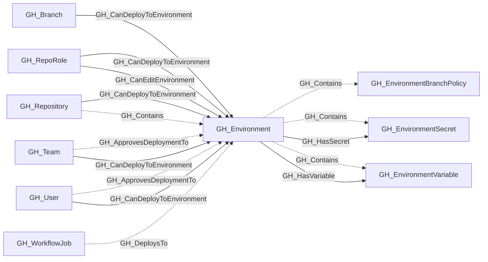

## General Information

Represents a GitHub Actions deployment environment configured on a repository. Environments can have protection rules including required reviewers, wait timers, administrator bypass behavior, and deployment branch policies.

Repositories always contain their environments. When custom branch policies are configured, the environment also contains one or more [GH_EnvironmentBranchPolicy](https://github.com/SpecterOps/bloodhound-docs/blob/main//opengraph/extensions/github/nodes/gh_environmentbranchpolicy) nodes that describe which branches are allowed to deploy. Environment-scoped secrets and variables are modeled as child nodes of the environment and become available to workflow jobs that reference it.

## Properties

| Property | Type | Description |
| --- | --- | --- |
| `name` | `string` | The node name used for matching and display. |
| `displayname` | `string` | The human-readable display name. |
| `environmentid` | `string` | The identifier of the GitHub environment where this node was collected. |
| `last_seen` | `datetime` | The timestamp when this node was last observed during collection. |
| `node_id` | `string` | The stable identifier used as the OpenGraph node ID; this is the native GitHub node ID where available. |
| `collected` | `boolean` | Collected/generated by OpenHound. |
| `short_name` | `string` | The environment's display name (e.g., `production`, `staging`). |
| `can_admins_bypass` | `boolean` | Whether repository administrators can bypass environment protection rules. |
| `wait_timer` | `integer` | The wait timer value. |
| `required_reviewers` | `boolean` | The required reviewers value. |
| `reviewer_count` | `integer` | The reviewer count value. |
| `prevent_self_review` | `boolean` | The prevent self review value. |
| `protected_branches` | `boolean` | The protected branches value. |
| `custom_branch_policies` | `boolean` | The custom branch policies value. |
| `repository_name` | `string` | The full name of the containing repository. |
| `repository_id` | `string` | The ID of the containing repository. |
| `environment_name` | `string` | The name of the environment (GitHub organization). |

## Diagram

```mermaid
graph LR
    n0["GH_Branch"]
    n1["GH_Environment"]
    n2["GH_EnvironmentBranchPolicy"]
    n3["GH_EnvironmentSecret"]
    n4["GH_EnvironmentVariable"]
    n5["GH_RepoRole"]
    n6["GH_Repository"]
    n7["GH_Team"]
    n8["GH_User"]
    n9["GH_WorkflowJob"]
    n0 -->|GH_CanDeployToEnvironment| n1
    n1 -.->|GH_Contains| n2
    n1 -.->|GH_Contains| n3
    n1 -->|GH_HasSecret| n3
    n1 -.->|GH_Contains| n4
    n1 -->|GH_HasVariable| n4
    n5 -->|GH_CanDeployToEnvironment| n1
    n5 -->|GH_CanEditEnvironment| n1
    n6 -->|GH_CanDeployToEnvironment| n1
    n6 -.->|GH_Contains| n1
    n7 -.->|GH_ApprovesDeploymentTo| n1
    n7 -->|GH_CanDeployToEnvironment| n1
    n8 -.->|GH_ApprovesDeploymentTo| n1
    n8 -->|GH_CanDeployToEnvironment| n1
    n9 -.->|GH_DeploysTo| n1
```

## Edges

<Note>
The tables below list edges defined by the GitHub extension only. Additional edges to or from this node may be created by other extensions.
</Note>

```mermaid
flowchart LR

    GH_Branch["GH_Branch"]
    GH_Environment["GH_Environment"]
    GH_EnvironmentBranchPolicy["GH_EnvironmentBranchPolicy"]
    GH_EnvironmentSecret["GH_EnvironmentSecret"]
    GH_EnvironmentVariable["GH_EnvironmentVariable"]
    GH_RepoRole["GH_RepoRole"]
    GH_Repository["GH_Repository"]
    GH_Team["GH_Team"]
    GH_User["GH_User"]
    GH_WorkflowJob["GH_WorkflowJob"]
    GH_Branch -- GH_CanDeployToEnvironment --> GH_Environment
    GH_Environment -- GH_Contains --> GH_EnvironmentBranchPolicy
    GH_Environment -- GH_Contains --> GH_EnvironmentSecret
    GH_Environment -- GH_Contains --> GH_EnvironmentVariable
    GH_Environment -- GH_HasSecret --> GH_EnvironmentSecret
    GH_Environment -- GH_HasVariable --> GH_EnvironmentVariable
    GH_RepoRole -- GH_CanDeployToEnvironment --> GH_Environment
    GH_RepoRole -- GH_CanEditEnvironment --> GH_Environment
    GH_Repository -- GH_CanDeployToEnvironment --> GH_Environment
    GH_Repository -- GH_Contains --> GH_Environment
    GH_Team -- GH_ApprovesDeploymentTo --> GH_Environment
    GH_Team -- GH_CanDeployToEnvironment --> GH_Environment
    GH_User -- GH_ApprovesDeploymentTo --> GH_Environment
    GH_User -- GH_CanDeployToEnvironment --> GH_Environment
    GH_WorkflowJob -- GH_DeploysTo --> GH_Environment
```

### Inbound Edges

| Edge Type | Source Node Types | Traversable |
| --------- | ----------------- | ----------- |
| [GH_ApprovesDeploymentTo](https://github.com/SpecterOps/bloodhound-docs/blob/main//opengraph/extensions/github/edges/gh_approvesdeploymentto) | [GH_Team](https://github.com/SpecterOps/bloodhound-docs/blob/main//opengraph/extensions/github/nodes/gh_team), [GH_User](https://github.com/SpecterOps/bloodhound-docs/blob/main//opengraph/extensions/github/nodes/gh_user) | ❌ |
| [GH_CanDeployToEnvironment](https://github.com/SpecterOps/bloodhound-docs/blob/main//opengraph/extensions/github/edges/gh_candeploytoenvironment) | [GH_Branch](https://github.com/SpecterOps/bloodhound-docs/blob/main//opengraph/extensions/github/nodes/gh_branch), [GH_RepoRole](https://github.com/SpecterOps/bloodhound-docs/blob/main//opengraph/extensions/github/nodes/gh_reporole), [GH_Repository](https://github.com/SpecterOps/bloodhound-docs/blob/main//opengraph/extensions/github/nodes/gh_repository), [GH_Team](https://github.com/SpecterOps/bloodhound-docs/blob/main//opengraph/extensions/github/nodes/gh_team), [GH_User](https://github.com/SpecterOps/bloodhound-docs/blob/main//opengraph/extensions/github/nodes/gh_user) | ✅ |
| [GH_CanEditEnvironment](https://github.com/SpecterOps/bloodhound-docs/blob/main//opengraph/extensions/github/edges/gh_caneditenvironment) | [GH_RepoRole](https://github.com/SpecterOps/bloodhound-docs/blob/main//opengraph/extensions/github/nodes/gh_reporole) | ✅ |
| [GH_Contains](https://github.com/SpecterOps/bloodhound-docs/blob/main//opengraph/extensions/github/edges/gh_contains) | [GH_Repository](https://github.com/SpecterOps/bloodhound-docs/blob/main//opengraph/extensions/github/nodes/gh_repository) | ❌ |
| [GH_DeploysTo](https://github.com/SpecterOps/bloodhound-docs/blob/main//opengraph/extensions/github/edges/gh_deploysto) | [GH_WorkflowJob](https://github.com/SpecterOps/bloodhound-docs/blob/main//opengraph/extensions/github/nodes/gh_workflowjob) | ❌ |

### Outbound Edges

| Edge Type | Destination Node Types | Traversable |
| --------- | ---------------------- | ----------- |
| [GH_Contains](https://github.com/SpecterOps/bloodhound-docs/blob/main//opengraph/extensions/github/edges/gh_contains) | [GH_EnvironmentBranchPolicy](https://github.com/SpecterOps/bloodhound-docs/blob/main//opengraph/extensions/github/nodes/gh_environmentbranchpolicy), [GH_EnvironmentSecret](https://github.com/SpecterOps/bloodhound-docs/blob/main//opengraph/extensions/github/nodes/gh_environmentsecret), [GH_EnvironmentVariable](https://github.com/SpecterOps/bloodhound-docs/blob/main//opengraph/extensions/github/nodes/gh_environmentvariable) | ❌ |
| [GH_HasSecret](https://github.com/SpecterOps/bloodhound-docs/blob/main//opengraph/extensions/github/edges/gh_hassecret) | [GH_EnvironmentSecret](https://github.com/SpecterOps/bloodhound-docs/blob/main//opengraph/extensions/github/nodes/gh_environmentsecret) | ✅ |
| [GH_HasVariable](https://github.com/SpecterOps/bloodhound-docs/blob/main//opengraph/extensions/github/edges/gh_hasvariable) | [GH_EnvironmentVariable](https://github.com/SpecterOps/bloodhound-docs/blob/main//opengraph/extensions/github/nodes/gh_environmentvariable) | ✅ |

## Properties

| Property | Type | Description |
| -------- | ---- | ----------- |
| `name` | `str` | - |
| `displayname` | `str` | - |
| `environmentid` | `str` | - |
| `last_seen` | `datetime` | - |
| `node_id` | `str` | - |
| `collected` | `bool` | Collected/generated by OpenHound |
| `short_name` | `str \| None` | The environment's display name (e.g., `production`, `staging`). |
| `can_admins_bypass` | `bool \| None` | Whether repository administrators can bypass environment protection rules. |
| `wait_timer` | `int \| None` | - |
| `required_reviewers` | `bool` | - |
| `reviewer_count` | `int` | - |
| `prevent_self_review` | `bool \| None` | - |
| `protected_branches` | `bool \| None` | - |
| `custom_branch_policies` | `bool \| None` | - |
| `repository_name` | `str \| None` | The full name of the containing repository. |
| `repository_id` | `str \| None` | The ID of the containing repository. |
| `environment_name` | `str \| None` | The name of the environment (GitHub organization). |
